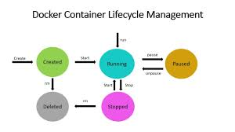
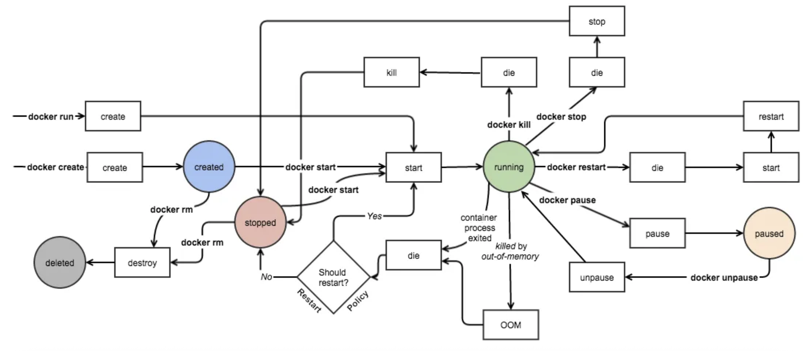

# Docker Study

**Docker Installation Guide**: [Get Started](https://www.docker.com/get-started/), [Medium Guide](https://medium.com/@piyushkashyap045/comprehensive-guide-installing-docker-and-docker-compose-on-windows-linux-and-macos-a022cf82ac0b), [Setup Guide](https://docs.docker.com/desktop/setup/install/windows-install/), [Git Guide](https://github.com/WCSCourses/index/blob/main/Docker_guide.md)

**Resources**:
- [Docker Tutorial for Beginners](https://www.youtube.com/watch?v=pTFZFxd4hOI)
- [Docker Containers and Kubernetes Fundamentals – Full Hands-On Course](https://www.youtube.com/watch?v=kTp5xUtcalw&t=2475s)
- [Docker Tutorial for Beginners FULL COURSE in 3 Hours](https://www.youtube.com/watch?v=3c-iBn73dDE)
- [Complete Docker Course - From BEGINNER to PRO! (Learn Containers)](https://www.youtube.com/watch?v=RqTEHSBrYFw&t=15783s)
- [Docker and Kubernetes - Full Course for Beginners](https://www.youtube.com/watch?v=Wf2eSG3owoA&t=6384s)
- [Docker Tutorial for Beginners | Full Course - 2021](https://www.youtube.com/watch?v=p28piYY_wv8)
- [Docker from beginner to expert Medium article](https://medium.com/@techsuneel99/docker-from-beginner-to-expert-a-comprehensive-tutorial-5efec10c82ab)
- [GeeksforGeeks Docker tutorial](https://www.geeksforgeeks.org/docker-tutorial/)
- [tutorialspoint Docker Guide](https://www.tutorialspoint.com/docker/index.htm)
- [Play with Docker](https://www.docker.com/play-with-docker/)
- [Docker Curriculum](https://docker-curriculum.com/)
- [Awesome Docker](https://github.com/veggiemonk/awesome-docker)
- [Docker Docs](https://docs.docker.com/get-started/)
- [Docker Ultimate Cheatsheet](https://dockerlabs.collabnix.com/docker/cheatsheet/)
- [Docker Cheatsheet](https://docs.docker.com/get-started/docker_cheatsheet.pdf)

**Paid resources**:
- [Docker & Kubernetes: The Practical Guide - 2025 Edition](https://www.udemy.com/course/docker-kubernetes-the-practical-guide/?couponCode=24T7MT260525G2)
- [Docker for the Absolute Beginner - Hands On - DevOps](https://www.udemy.com/course/learn-docker/?couponCode=24T7MT260525G2)
- [Docker Mastery: with Kubernetes +Swarm from a Docker Captain](https://www.udemy.com/course/docker-mastery/?couponCode=24T7MT260525G2)

**Alternatives**:  [Podman](https://podman.io/), [containerd](https://containerd.io/)

## Table of Content

- [Introduction](#introduction)  
  - [Images](#images)  
  - [Containers](#containers)  
- [Docker CLI commands](#docker-cli-commands)  
- [App in Container](#app-in-container)  
  - [Operations with Containers](#operations-with-containers)  
- [Service in Container](#service-in-container)  
- [Debugging Containers](#debugging-containers)  
  - [Execute some commands inside the containers](#execute-some-commands-inside-the-containers)  
  - [Attach/Dettach](#attach-dettach)  
  - [Copying data](#copying-data)  
  - [Exporting container filesystem](#exporting-container-filesystem)  
  - [Listing container processes](#listing-container-processes)  
  - [Container's resource usage](#containers-resource-usage)  
  - [Listing Changed content](#listing-changed-content)  
  - [Container inspection](#container-inspection)  
  - [System events](#system-events)  
- [Images](#images-1)  
  - [Key Concepts](#key-concepts)  
  - [Analyzing the image](#analyzing-the-image)  
  - [Building images](#building-images)  
  - [Build context](#build-context)  
  - [.dockerignore](#dockerignore)  
- [Dockerfile](#dockerfile)  
  - [FROM (Build-time command)](#from-build-time-command)  
  - [WORKDIR (build-time and runtime command)](#workdir-build-time-and-runtime-command)  
  - [COPY (build-time command)](#copy-build-time-command)  
  - [ADD (build-time command)](#add-build-time-command)  
  - [RUN (build-time command)](#run-build-time-command)  
  - [ENV (build-time and runtime command)](#env-build-time-and-runtime-command)  
  - [ENTRYPOINT and CMD (runtime commands)](#entrypoint-and-cmd-runtime-commands)  
  - [LABEL (build-time command)](#label-build-time-command)  
  - [EXPOSE](#expose)  
  - [Creating images manually](#creating-images-manually)  
  - [Volume instruction (for Docker image build)](#volume-instruction-for-docker-image-build)  
  - [Volume Operations](#volume-operations)  
    - [Initial data for the volume](#initial-data-for-the-volume)  
    - [Look inside a volume](#look-inside-a-volume)  
- [Volumes](#volumes)  
  - [Bind mounts](#bind-mounts)  
  - [Volumes](#volumes-1)  
- [Networking](#networking)  
  - [Network drivers](#network-drivers)  
  - [User-defined Bridge](#user-defined-bridge)  
  - [Host network](#host-network)  
- [Docker Compose](#docker-compose)  
  - [Example of compose.yml](#example-of-composeyml)  
  - [Build images](#build-images-1)  
  - [Rebuild images](#rebuild-images)  
  - [Bring the system down](#bring-the-system-down)  
  - [Specify compose files](#specify-compose-files)  
  - [Running a single service](#running-a-single-service)  
  - [Specify service dependencies](#specify-service-dependencies)  
  - [Naming project dynamically](#naming-project-dynamically)  
  - [Using non-default environment](#using-non-default-environment)  
- [Extra](#extra)

## Introduction

**The problems**:

- Works on my machine :)
- Deploy software with different dependecies and configurations
- Upgrade and/or downgrade software
- Limit resource usage
- Ineffective hardware usage

**Deployment approaches**:

- Traditional deployment (doesn't tackle the mentioned issues efficiently)
- Virtual machines (Running multiple OS concurrently with the help of Hypervisor/Virtual Machine Manager software on a single machine might solve the first 2 issues, but the VMs take too much space, consume additional/extra resources, hardware utilization is higher than the traditional deployment)
- Containers (containers are a form of virtualization more lightweight than VMs and they tackle the mentioned issues more efficiently; your machine will just see an another process running)

(Docker)[https://www.docker.com/] is an open-source project that automates the deployment of software applications inside containers by providing an additional layer of abstraction and automation of OS-level virtualization on Linux. Docker's Architecture is a client-server based system.

The Docker's "server" is called **Docker daemon**, it manages the Docker objects (containers, images, networks and volumes), it communicates with other daemons to manage Docker services and it is tightly coupled to the Linux Kernel.

The Docker Registry is the place where the Docker images are stored. A set of related images is called the repository (similar to GitHub repos). Docker Hub is a public registry that anyone can use to pull the images.

The Docker's client uses the Docker API (via command line interface) to communicate with the daemon.

### Images

An image is a read-only template with instructions for creating a Docker container that consists of multiple read-only layers. To build your own image, you need to create a Dockerfile for defining the steps needed to create the image and run it. When you change the Dockerfile and rebuild the image, only those layers which have changed are rebuilt.

### Containers

A container is a runnable instance of an image. You can start, create, stop or delete a container using the Docker API or CLI. You can also connect a container to networks, attach storage (volumes) to it, decide which part of the container subsystems (network, filesystem) are exposed to other containers or host OS. If you delete a container, any changes or data to its state that are **not** stored in persistent storage will disappear.

## Docker CLI commands

Old style syntax:

```
docker COMMAND ARGUMENTS
```
For example (to retrieve the list of containers):
```
docker ps
```

New style syntax:

```
docker COMMAND SUBCOMMAND ARGUMENTS
```

For example:
```
docker container list
```

Retrieve the full list of commands and their parameters:
```
docker help
docker COMMAND help
docker COMMAND SUBCOMMAND --help
```


## App in Container

From the OS perspective, a container is another isolated process on your machine (you can think of it as an extended version of chroot).

From the Docker perspective, a container is a runnable instance of an image. You can the isolation level of a container.

### Operations with Containers 

Run a command in a new container:
```
docker container run [OPTIONS] IMAGE [COMMAND] [ARG...]
```

**Note**: If Docker cannot find the IMAGE locally, it will download it from the (Docker Hub)[https://hub.docker.com/] automatically.

Run your first container:
```
docker container run hello-world
```

An image contains all the content for the application, along with instructions telling Docker how to start the app.

Ways to work with containers:
- Running batch apps or scripts
- Run long running apps within the container (e.g web server)
- Connect to the container like to remote computer

Run container interactively
```
docker container run -it alpine
```

--interactive = set up connection to the container
--tty = connect to a terminal session inside the container


List containers
```
docker container ls [OPTIONS]
# or
docker container list [OPTIONS]
# or
docker container ps [OPTIONS]
```

Name your container:
```
docker container run -it --name p36 python:3.6
```

Rename a container:
```
docker container rename CONTAINER NEW_NAME
```

**Note**: CONTAINER can be CONTAINER ID, IMAGE OR NAMES (container name).

List stopped containers:
```
docker container ls -all
```

Remove a (stopped) container:
```
docker container rm [OPTIONS] CONTAINER [CONTAINER...]
```

Example:
```
docker container rm -f [First characters of CONTAINER ID]
```

**Note**: Add -f or --force flag to remove a running container

Clean up all stopped containers:
```
docker container rm $(docker container -f status=exited -q)
```

Or (a better way):

```
docker container prune [OPTIONS]
```

Example:

```
docker container prune --force --filer "until=5m"
```

**Note**: In this case, --force flag doesn't touch the running containers but it will get rid of the confirmation.

Removing container automatically on stop:
```
docker container run -it --rm alpine
```

## Service in Container

Additional parameters to use with "docker container run":

- "-d, --detach"; starts the container in the background and shows the container ID
- "-p, --publish"; publishes a port from the container to the computer
  - Format [ip]:<hostPort>:<containerPort>

Example:
```
docker container run --rm -d -p 8080:80 nginx
```

Docker creates its own network and assigns IP addresses from it to containers. Containers aren't exposed to the outside world by default. For exposed ports, Docker intercepts the incoming traffic (from localhost:8080 for example) and sends it to the container (container IP with port 80) and vice versa. You can publish ports only if you create and run containers.

List port mappings or a specific mapping for the container:
```
docker container port CONTAINER [PRIVATE_PORT[/PROTO]]
```

To stop a service container:
```
docker container stop [OPTIONS] CONTAINER [CONTAINER...]
```

**Note**:The main process inside the container will receive **SIGTERM**, and after a grace period, **SIGKILL**. You can change the first signal (with **STOPSIGNAL** via --stop-signal flag to docker container run or via container's Dockerfile.

**Note2**: You can extend the graceful shutdown time via --time flag.

```
docker container stop --time 120 my_busy_container
```

Kill one or more running containers:
```
docker container kill [OPTIONS] CONTAINER [CONTAINER...]
```

**Note**: The main process inside the container is sent **SIGKILL** signal by default.

You can specify custom signal via --signal flag. It is useful for the scenarios where some containers react to signals in other way than just terminating.

To start one or more stopped containers (it doesn't create a new container):
```
docker container start [OPTIONS] CONTAINER [CONTAINER...]
```

Attach shell to a stopped container:
```
docker container start --attach --interactive my_container
# or
docker container start -ai my_container
```

Restart one or more containers:
```
docker container restart [OPTIONS] CONTAINER [CONTAINER...]
```

Create a new container:
```
docker container create [OPTIONS] IMAGE [COMMAND] [ARG...]
```

Run a command in a new container:
Create a new container:
```
docker container run [OPTIONS] IMAGE [COMMAND] [ARG...]
```

Restart policy:
- no (the default): Do not automatically restart the container
- on-failure: Restart the container if it exits due to an error(non-zero exit) or if the app crashes
- always: Always restart the container if it stops. If it is manually stopped, it is restarted only when Docker daemon restarts.
- unless-stopped: Like always, except that when the container is stopped, it is not restarted even after Docker daemon starts.

```
docker container run --restart always container
```

Pause a container or more containers:
```
docker container pause CONTAINER [CONTAINER...]
```

Unpause all processes within one or more containers:
```
docker container unpause CONTAINER [CONTAINER...]
```

Docker Container Lifecycle:





Sources: [1](https://medium.com/@BeNitinAgarwal/lifecycle-of-docker-container-d2da9f85959), [2](https://k21academy.com/docker-kubernetes/docker-container-lifecycle-management/), [3](https://dev.to/docker/docker-architecture-life-cycle-of-docker-containers-and-data-management-1a9c)


## Debugging Containers

Fetch the logs of a container:
```
docker container logs [OPTIONS] CONTAINER
```

**Loggings tips**:
- The logs are scraped by Docker and stored outside of the container.
- You can access the logs at any time during container use (even when the container is stopped). 
- When you remove the container the logs get deleted
- Containerised apps should **NEVER** log to file system (it is an anti-pattern because this make container heavier than necessary).
- Just log to standard output and let Docker do the rest.

Timestamps the log entries with **--timestamps** or **-t**:
```
docker container logs --timestamps my_container
```

Keep the logs coming with **--follow** or **-f** flag:
```
docker container logs my_container --follow
```

Limiting output using **--tail** or **-n** flag:
```
docker container logs -t --tail 2 my_container 
```

**Note**: You can combine **-f** and **--tail** flags to retrieve the incoming logs line by line:
```
docker container logs -f --tail=1 my_container 
```

Limiting output using **--since** or **--until** flag:
```
docker container logs -t --since 2024-09-04T12:06:35.3545353Z 2 my_container
# or
 docker container logs -t --since 45m 2 my_container
```

**Note**: The timestamp format has to follow the ISO format.

### Execute some commands inside the containers

Run a command in a running container:
```
docker container exec [OPTIONS] CONTAINER COMMAND [ARG...]
```

For example:
```
docker container run nginx
docker container exec nginx ls -al /usr/share/nginx/html
docker container exec --workdir /usr/share/nginx/html nginx ls -al 
docker container exec -it nginx bash
```

**Tips**:
- **-d**, **--detach** allows to run the additional command in the background.
- The command you specify with **docker container exec** only runs while the container's primary process (PID 1) is running.
- If you restart the container the additional command is killed.
- The command runs in a default working directory (which is set by the creator of the image) of the container.
- The command must be an executable (not a chained or quoted)
- A good use case to exec is running a database:
```
docker container run --name db1 -p 3306:3306 -d \
-e MYSQL_ROOKT_PASSWORD=rootpw -e MYSQL_DATABASE=sales mysql:8
docker container exec -it db1 mysql --uroot --prootpw sales
```

### Attach/Dettach

**Note**: To detach from a running container (that is in the interactive mode) without killing it press {Ctrl+P}, {Ctrl+Q}. Take into account that the container will still be running in the background. {Ctrl+C} will kill the container. Be cautious, the commands may differ depending on the machine's OS.

Attach local standard input, output, and error streams to a running container:
```
docker container attach [OPTIONS] CONTAINER
```
**Note**: In other words, this command will bring the container back in the foreground.

Attach and Detach Options Table:
| **start command** | `-d`  | `--sig-proxy` (default is true) | `--no-stdin` (default is missing) | **attach** | **input** | **keys**  | `^C`             | `^P ^Q`      |
|-------------------|--------|--------------------------------|------------------------------------|------------|------------|----------|------------------|--------------|
| `docker run`      | `*`    | `true`                        | `*`                                | ignore     | SIGINT (L) | ignore (W) | ignore          |
| `docker run -i`   | `*`    | `true`                        | `*`                                | ignore     | SIGINT (L) | ignore (W) | ignore          |
| `docker run -t`   | `*`    | `false`                       | `*`                                | detach     |            |           |                  |
| `docker run -it`  | `*`    | `*`                           | (missing)                          | accept     | SIGINT     | detach    |                  |
| `docker run -it`  | `*`    | `*`                           | (present)                          | ignore     | detach     | ignore    |                  |

* `*` = any value, doesn’t matter

[Source](https://stackoverflow.com/questions/19688314/how-do-you-attach-and-detach-from-dockers-process)

### Copying data

Copy files/folders between a container and the local filesystem:
```
docker container cp [OPTIONS] CONTAINER:SRC_PATH DEST_PATH|-
docker container cp [OPTIONS] SRC_PATH|- DEST_PATH:CONTAINER
```

### Exporting container filesystem

Export a container's filesystem:
```
docker container export [OPTIONS] CONTAINER
```

**Note**: **docker export** ignores the volumes

Example:
```
docker container export nginx > nginx-files.tar
docker container export --output nginx-files.tar nginx
```

### Listing container processes

Display the running processes of a container:
```
docker container top CONTAINER [ps OPTIONS]
```

**Note**: The **aux** option will provide extra column for things like CPU and RAM usage.

### Container's resource usage

Display a live stream of container(s) resource usage statistics:
```
docker container stats [OPTIONS] [CONTAINER]
```

To check the storage memory consumed by Docker:
```
docker system df
```

### Listing Changed content

Inspect changes to files or directories on a container's filesystem:
```
docker container diff CONTAINER
```

**Note**: The output content will have some prefixes: `A` means that the file/directory has been added/created, `d` means that the file/directory has been deleted, `C` means that the file/directory has been changed.

### Container inspection

Return low-level information on Docker objects:
```
docker container inspect [OPTIONS] CONTAINER [CONTAINER...]
```

**Note**: The output will be in a JSON format.
**Note2**: Some relevant details to look for are the following: network-related information, environment variables and the command used to run the container.

Extract only the relevant data:
```
docker container inspect CONTAINER | jq -C .[].NetworkSettings.Ports
```

**Note**: You can also use `grep`.

### System events

Get real time events from the server:
```
docker system events [OPTIONS]
docker system events --filter container=CONTAINER
```

## Images

A Docker image is a lightweight, stand-alone, and executable package that includes everything needed to run an app.

**Key Concepts**:
- Layers (each layer represent a step in the Dockerfile; script to define the image)
- Read-only (Immutable)
- Base and derived images
- Portability
- Size
- Registry


Pull an image or repository from a registry:
```
docker image pull [OPTIONS] NAME[:TAG|@DIGEST]
```

**Note**: To check the available tags you have to navigate to Docker Hub.
**Note2**: You can use digest to pinpoint the exact image binary. It is helpful if you treat those images as base images for further development of custom images.

List Images:
```
docker image ls[or list] [OPTIONS] [REPOSITORY[:TAG]]
```

Remove one or more images:
```
docker image rm [OPTIONS] IMAGE [IMAGE...]
```

**Note**: You can also use Docker Desktop to facilitate the deleting process of the images/dangling images.

Show docker disk usage:
```
docker system df [OPTIONS]
```

RECLAIMABLE space is the space consumed by "unused images" i.e no containers based on those images are running. This is the total size of images/containers you can remove without breaking anything from the current runtime perspective.


Remove unused images:
```
docker image prune [OPTIONS]
```

To remove all images without at least one container associated to them:
```
docker image prune --all
```

### Analyzing the image

Show the history of an image:
```
docker image inspect [OPTIONS] IMAGE [IMAGE...]
```

```
docker image history [OPTIONS] NAME[:TAG|@DIGEST]
```
**Note**: This will also output the layers of the image.

### Building images

Docker can build images automatically by reading the instructions from a **Dockerfile**.

A Dockerfile is a text document that contains all the commands a user could call on the command line to assemble a runtime environment. Using docker build users can create an automated build that executes several command-line instructions in succession.


Example of Dockerfile:
```
FROM busybox:latest
CMD echo "Hello World!"
```

Build an image from a Dockerfile:
```
docker builder build [OPTIONS] PATH|URL|-
docker image build [OPTIONS] PATH|URL|-
docker build [OPTIONS] PATH|URL|-
# example (. is the current working directory)
docker builder build .
```

An old way to build docker images that outputs more details about the process:
```
DOCKER_BUILDKIT=0 docker builder build .
```

**Note**: Everything that doesn't change often should be built into the image first (or at the beginning of the Dockerfile), meanwhile the elements of the image that change frequently should be placed near the end of the Dockerfile (remember the layered structure and that each instruction creates a new layer; also take into account that Docker uses caching mechanism to rebuilt only the changed components/images).


Create a tag TARGET_IMAGE that refers to SOURCE_IMAGE:
```
docker image tag SOURCE_IMAGE[:TAG] TARGET_IMAGE[:TAG]
```

Name and tag the image during build:
```
docker builder build --tag hello:1.1 .
```

### Build context

What do we need to build an image:
- base image (expressed by the FROM instruction in the Dockerfile)
- a collection of files we are going to add on top of the base image (put them into a single directory -build context- on your development machine)
- Commands: FROM, COPY, WORKDIR, CMD

Example of Dockerfile for a java app:
```
FROM openjdk:17
COPY app.* /app/
WORKDIR /app
CMD ["java", "-jar", "app.jar"]
```

Docker command to build the image:
```
docker build -t image:[TAG] [PATH|.]
```

### .dockerignore

It is similar to `.gitignore` file and tells Docker which files it should ignore during the builing. The only difference is in the filtering process of multiple files/folders with the same name that are located in different locations.
Example:
```
.git/
temp/
*.txt
README.md
# It will find all the target folders in the projects
**/target
# It will find all the .tmp files from all the folders within the project
**/*.tmp
# This will include the README.md file in the build by overriding the previous rule
*.md
!README.md
# Match only one character (fileA.txt, file1.txt, etc.)
file?.txt
```

## Dockerfile

A Dockerfile is made up of instructions, comments, parser directives, and empty lines:
Syntax:
```
# Comment
INSTRUCTION arguments
```

Any instruction will do a specific action in a new layer on top of the current image and create a new layer that is available for the next steps in the Dockerfile.
Example (This Dockerfile will have 5 layers):
```
FROM bash
COPY signals.sh /app/
WORKDIR /app
RUN chmod +x signals.sh
CMD [ "/bin/sh", "-c", "./signals.sh"]
```
### FROM (Build-time command)

Every image needs to start from a base image.
The **FROM** tells Docker Engine which base image to use for subsequent instructions. Every valid Dockerfile must start with a **FROM** instruction.
```
FROM <image> [AS <name>]
FROM <image>[:<tag>|latest if tag is not mentioned] [AS <name>]
FROM <image>[@digest] [AS <name>]
```

### WORKDIR (build-time and runtime command)

The **WORKDIR** sets the current working directory for the instruction: COPY, ADD, RUN, ENTRYPOINT, CMD.

If the WORKDIR doesn't exist, it will be created even if it is not used in any subsequent Dockerfile instruction.

```
WORKDIR /path/to/directory
```

**Note**: WORKDIR can be set multiple times.

### COPY(build-time command)

The **COPY** copies new files or directories (retaining their attributes and permissions) from <src> and adds them to the filesystem of the container at the path <dest>:
```
COPY [OPTIONS] <src>... <dest>
```

**Note**: Shell patterns (*, ?) are available. Also trailing slash (/) is significant for proper behaviour of COPY command.

Examples:
```
# 1. Copy a local directory into the container
COPY ./app /usr/src/app

# 2. Copy a specific file to a specific location
COPY index.html /usr/share/nginx/html/index.html

# 3. Use shell wildcard to copy multiple files
COPY src/*.js /app/js/

# 4. Preserve permissions and set executable bit
COPY --chmod=755 ./scripts/start.sh /usr/local/bin/start.sh

# 5. Copy a configuration file into a container directory
COPY config/settings.yaml /etc/myapp/

# 6. Copy multiple files to the same destination
COPY requirements.txt entrypoint.sh /app/
```

To set permissions inside the image:
```
COPY --chmod=<permision> switch
# COPY -chmod 600 file.txt target/
```

**Note**: Building on Windows makes the files get `rwxr-xr-x` permissions. Default permission on Windows is 644, for Linux/MacOS is 666.


### ADD(build-time command)

The **ADD** copies files into the image as **COPY** does:
```
ADD [OPTIONS] <src>... <dest>
```

but allows to:
- download file by URL and copy to specific destination (artifacts)
- extract local tarball to specific destination
- work with remote git repositories (branches, tags, etc.)

**Note**: For simpler scenarios when you only need to copy some local files into the container use **COPY**.

### RUN (build-time command)

The **RUN** instruction will execute any commands:
```
# shell form
RUN <command>

# exec form
RUN ["executable", "parameter 1", " parameter 2"]
```

Exec form example:
```
FROM alpine:3

# specify arguments as separate array elements
RUN ["apk", "add", "nano"]

# will not work as expected, no shell => no variables nor wildcards
RUN ["echo", "$HOME"]

# run the shell
RUN ["sh", "-c", "echo $HOME"] 
```

Shell form example:
```
FROM ubuntu:24.04
RUN apt-get update \
	&& apt-get install -y git cmake gcc \
	&& rm -rf /var/lib/apt/lists/*
```

Security example:
```
FROM alpine:3
# this layer caches the password => potential security issue
RUN echo $RANDOM > /tmp/mypassword
RUN cat mypassword
RUN rm /tmp/mypassword
```

```
FROM alpine:3
# No security issue
RUN echo $RANDOM > /tmp/mypassword \
	&& cat mypassword \
	&& rm /tmp/mypassword
```


### ENV (build-time and runtime command)

The **ENV** instruction sets the environment variable <key> to the value <value>:
```
ENV <key>=<value> ...
```

To inspect the environment variables:
```
docker image inspect IMAGE | jq -C .[].Config.Env
# or
docker container inspect IMAGE | jq -C .[].Config.Env
```

**Note**: use **--env** and **-e** flags to set environment variables when running docker container run command. You can also use **--env-file=<file>** to reference a file with defined variables.

One use case for the environment variables is when running a database container, for example MYSQL, where you need to specify **MYSQL_ROOT_PASSWORD** (let's say) as an environment variable.

**Pitfall**: Environment variable persistence can cause unexpected side effects. If an environment variable is only needed during build, and not in the final image, consider setting a value for a single command instead.
```
FROM ubuntu
# This will change  the behaviour of apt-get
ENV DEBIAN_FRONTEND=noninteractive
RUN apt-get && apt-get install -y ...
# Add the environment variable just before your command declared in the RUN instruction
RUN DEBIAN_FRONTEND=noninteractive apt-get && apt-get install -y ...
```


### ENTRYPOINT and CMD (runtime commands)

Both **CMD** and **ENTRYPOINT** instructions define what command gets executed when running a container. Both have the exec and shell forms:
```
# exec form, this is the prefered form
ENTRYPOINT ["executable", "param1", "param 2"]

#shell form
ENTRYPOINT command param1 param2

# exec form, this is the prefered form
CMD ["executable", "param1", "param 2"]

#shell form
CMD command param1 param2
```

Example ENTRYPOINT + CMD:
```
docker container run --entrypoint ep IMAGE cmd1/arg1 cmd2/arg2
```

**Note**: A command is run in a shell using /bin/sh -c on Linux and cmd /S /C on Windows.

ENTRYPOINT will define the part of the startup command that will rarely change.
CMD will define the path the user may want to easily override.

Inspect CMD and ENTRYPOINT that was set for an image:
```
docker image inspect alpine | \
	jq -C '.[].Config | pick ( .Cmd, .Entrypoint )'
```

To override a CMD:
```
docker container run --rm -it alpine ls -la
```

**Note**: Nginx has CMD argument where if an user runs a container with this image and different CMD, it won't run Nginx anymore:
```
docker container run -it --rm nginx bash
root@2443afsasaf2:/# cat docker-entrypoint.sh
# long output
```

Example of using ENTRYPOINT and CMD:
```
# Dockerfile
FROM alpine:3
ENTRYPOINT [ "ping" ]
CMD [ "google.com" ]

# Command to build the image
docker builder build -t ping .

# Run container with no arguments
docker container run --rm ping

# Run container with arguments
docker container run --rm ping cnn.com

# Run other commands overriding the image entirely (entrypoint needs to be an executable)
docker container run --rm -it --entrypoint "ls" ping -la

# Run commands with chaining (couting directories)
docker container run --rm -it --entrypoint "sh" ping -c "ls -l | wc -l"

# Interactive container
docker container run --rm -it --entrypoint "sh" ping
```


#### ENTRYPOINT, CMD, and PID 1

In a container, the first process (`PID 1`) has special responsibilities:
- It does not receive Unix signals (like `SIGTERM`, `SIGINT`) the same way as regular processes.
- If ENTRYPOINT is a shell form (e.g., `ENTRYPOINT ping google.com`), then the shell (`sh`) becomes PID 1 — not the actual command.
- This can prevent proper signal handling and cause zombie processes.

**To prevent issues**:
- Use the exec form:
```
ENTRYPOINT ["your-app"]
```
Or, use a minimal init system (like `tini`):
```
ENTRYPOINT ["tini", "--", "your-app"]
```

**Why this matters**:

- If you use shell form:
```
ENTRYPOINT ping google.com
```
→ `/bin/sh` becomes PID 1
→ `ping` won't receive `SIGTERM` directly
→ container won't exit cleanly

- If you use exec form:
```
ENTRYPOINT ["ping", "google.com"]
```
→ `ping` is PID 1
→ receives signals properly
→ exits cleanly

**Best Practice**:
- Use `exec` form unless you specifically need shell features.
- Ensure the process launched as PID 1 handles signals or wrap it with `tini` or similar.

**Resources**: [1](https://www.docker.com/blog/docker-best-practices-choosing-between-run-cmd-and-entrypoint/). [2](https://cloud.theodo.com/en/blog/docker-processes-container), [3](https://www.datacamp.com/tutorial/docker-entrypoint), [4](https://github.com/krallin/tini), [5](https://hynek.me/articles/docker-signals/), [6](https://petermalmgren.com/signal-handling-docker/), [7](https://daveiscoding.hashnode.dev/why-do-you-need-an-init-process-inside-your-docker-container-pid-1).

### LABEL (build-time command)

Apply additional metadata information to your image using **LABEL** instruction:
```
LABEL <key>=<value> <key>=<value> ...
```

It is useful to organize images by project, record licensing information, aid in automation and so on:
```
LABEL com.example.version="0.0.1-beta"
LABEL com.example.release-date="2015-02-12"
LABEL vendor1="ACME Incorporated"
LABEL vendor2=ZENITH\ Incorporated
```

**Note**: You can also set multiple labels at once, using line-continuation characters (\) to break long lines

### EXPOSE

Expose a network port that your applications listens on:
```
EXPOSE <port> [<port>/<protocol>...]
```

Examples:
```
# defaults to TCP
EXPOSE 80
# Specify protocol explicitly
EXPOSE 3000/udp
```

**Note**: This instruction doesn't publish the port when running the container. It is FYI information. To publish the port use the **--publish** or **--publish -all** (to publish all exposed ports and map them to high-order ports) flag on `docker container run`.

### Creating images manually

Docker uses a layered file system (typically Union File System or OverlayFS) to manage images and containers efficiently. Each layer represents a set of changes, and containers add a new, writable top layer.
- Base image layers (e.g., alpine:3.20) are read-only
- When you `apk add nano`, the change is stored in the container's writable layer
- `docker commit` flattens those changes into a new image

Learn more about OverlayFS and Union File Systems:
- [OverlayFS and Docker Explained](https://docs.docker.com/engine/storage/drivers/overlayfs-driver/)
- [Understanding Docker Layers](https://docs.docker.com/get-started/docker-concepts/building-images/understanding-image-layers/)
- [Deep Dive into Docker Internals - Union Filesystem](https://martinheinz.dev/blog/44)
- [Understanding the docker container file system (OverlayFS)](https://iammathew.com/blog/understanding-docker-images/filesystem)

```
docker container run -it --name step1 alpine:3.20
/ # apk add nano
/ # exit
```

Turn the container into an image:
```
docker container list --all
docker image list
docker container commit --message "added nano" step1 alpine_with_nano:latest
```

Then use the new image:
```
docker image list
docker container run --rm -it alpine_with_nano:latest
docker image history alpine_with_nano:latest
```

Copy an app into the image:
```
# In terminal
$ cat << EOF > script.sh
> echo Hello World!
> EOF

# Then run those commands
docker container run -dit --name step2 alpine_with_nano:latest

docker container exec step2 mkdir /app

docker container cp script.sh step2:/app/

docker container exec step2 chmod +x /app/script.sh

# You can run docker container commit a running container but it won't be needed anymore so stop it
docker container stop step2

docker container commit --message "script.sh" step2 alpine_nano_app:latest

docker image list

```

Last step: Make the app the starting point of the container:
```
docker container run -it --name step3 alpine_nano_app:latest
/ # exit

docker container commit --change "CMD /app/script.sh" step3 myapp_alpha:latest
```

Apply metadata information:
```
docker container commit \
	--author "me <me@gmail.com>" \
	-- message "author" \
	-- step4 myapp:1.0
docker image history myapp:1.0
docker image inspect myapp:1.0
```

Run the app:
```
docker container run --rm --name myapp myapp:1.0
```

All the above work is equivalent to:
```
FROM alpine:3.20
RUN apk add nano
COPY --chmod 755 script.sh /app
CMD /app/script.sh
```

## Volumes

Your application need disk access:
- To read input data to process
- To store it's own private data
- To keep temporary data
- To cache the results of processing or interactions with other apps
- To write result data
- To interact with host's filesystem

Container Storage Issues:
- By default, all files created inside a container are stored on a writeable container layer. The data doesn't persist when the container no longer exists.
- A container's writeable layer is tightly coupled to the host machine where the container is running => difficult to share data across multiple containers and apps
- Storage drivers don't provide an acceptable level of performance in terms of read/write speed
- Large amounts of data written to the container's write layer will lead to performance degradation

How to avoid storage issues:
- Do not store the data in the container itself. Use an external: SQL/NoSQL Database, Cache, Binary Storage
- Use Docker mounts to allow container to read/store data efficiently


Strategies to persist the data:
- **Bind mounts** to mount host directory or file inside a container
- **Volumes** to store data inside a dedicated storage
- **tmpfs mounts** are stored in the host system's memory only (RAM), and are never written to the host system's filesystem.

### Bind mounts

```
--mount type=bind source=/path, target=/path
--volume /source/path:/target/path
```

Docker exposes the host directory or file mounting capabilities through the following options of the **docker container run** subcommand:
- **--volume** or **-v**
- **--mount** (recommended because it is more verbose and more clear)

**Note**: You can only create mounts during container creation!

Mounting a specified directory into the container:
```
# With -v or --volume flag
-v HOST_PATH:CONTAINER_MOUNT_PATH
-v HOST_PATH:CONTAINER_MOUNT_PATH:READ_WRITE_MODE

HOST_PATH = absolute path in the Docker host
CONTAINER_MOUNT_PATH = absolute path in the container filesystem
READ_WRITE_MODE can be either read-only/ro or read-write/rw (default) mode

# With --mount flag
--mount type=bind,source=HOST_PATH,target=CONTAINER_MOUNT_PATH
--mount type=bind,source=HOST_PATH,target=CONTAINER_MOUNT_PATH, READ_WRITE_MODE

READ_WRITE_MODE can be either readonly/ro mode or nothing
```

**Note**: To retrieve absolute path you can use **$(pwd)** (on Linux, Windows Powershell and MacOSX) or %cd% (on Windows Cmd).

To inspect Bind Mounts:
```
# Inside the container run the following command:
mount

docker container inspect --format "{{json .Mounts}}" container_name
# or
docker container inspect container_name | jq -C .[].Mounts
```

**Tricky Stuff related to Bind Mounts**:
- Bind mounts with a single file as the source work on Linux but not on Windows
- Mounting a single file on the host into an existing folder inside of the container will merge directory contents: both the files from the container and the one from the host
- Bind mount directories shadow the target directory if it exists
- Distributed storage systems may not provide all the usual filesystem features and they may offer far worse performance than a local storage.


### Volumes

= Virtual hard drives for the container that are managed (their lifecycle) by Docker.
```
-- mount type=volume,source=myvol,target=/db
--volume myvol:/db
```

Good to know:
- Volumes live on Docker host and their lifecycle is decoupled from container (volume survive container removal)
- It is possible to mount a single volume into 2 containers
- By default, volumes are just directories in host's filesystem
- Extend persistence capabilities using pluggable volume drivers

Advantages over bind mounts:
- Volumes can be managed via Docker CLI
- Volumes are easier to secure, back up or migrate
- Volumes might provide advanced functionality such as encryption or snapshots
- Bind mounts are dependent on the directory structure and OS of host machine while volumes are not
- New volumes can have their content pre-populated by a container
- Volumes are preffered. They also offer a proper level of abstraction

Create a volume:
```
docker volume create [OPTIONS] [VOLUME]
docker volume create --name=VOLUME
docker volume create VOLUME
```

Custom Network volumes:
```
docker volume create --driver local \
	-- opt type=nfs \
	-- opt o=addr=192.168.1.1,rw \
	-- opt device=:/path/yo/dir \
	nfs-drive
docker volume create --driver local \
	-- opt type=tmpfs \
	-- opt device=tmpfs \
	-- opt o=size=100m,uid=1000 \
	mem-drive
```

List volumes:
```
docker volume ls [OPTIONS]
```

Mounting a specified directory into the container:
```
# with -v or --volume flag

-v CONTAINER_MOUNT_PATH
-v VOLUME_NAME:CONTAINER_MOUNT_PATH
-v VOLUME_NAME:CONTAINER_MOUNT_PATH:READ_WRITE_MODE

VOLUME_NAME = name of the volume
CONTAINER_MOUNT_PATH = absolute path in the container filesystem
READ_WRITE_MODE can be either read-only/ro or read-write/rw (default) mode

# The first form will create an empty volume with a random name
# If you don't use absolute path for filesystem (aka VOLUME_NAME), Docker will interpret that you want to create a volume

# with --mount flag
--mount type=volume,source=VOLUME_NAME,target=CONTAINER_MOUNT_PATH
--mount type=volume,source=VOLUME_NAME,target=CONTAINER_MOUNT_PATH,READ_WRITE_MODE

# Here READ_WRITE_MODE can be either the readonly/ro mode or nothing
```

Example:
```
docker volume create vol1
docker container run -it -v vol1:/mydata --name alpine1 alpine

/ # ls -la
# see your mydata directory listed

# try removing the container
docker container rm alpine1

docker volume list
# You should still see vol1
```

Display detailed information on one or more volumes:
```
docker volume inspect [OPTIONS] VOLUME [VOLUME...]
```

Remove volume(s):
```
docker volume rm [OPTIONS] VOLUME [VOLUME...]
```

**Note**: The above command will remove only the unused volume(s). You can't remove an used volume (that is used in a running container).

Remove all unused local volumes (that are not referenced by any containers):
```
docker volume prune [OPTIONS]
# use --all to include all volumes (without --all flag only the anonymous unused volumes will be removed)
docker volume prune --all
```

### Volume instruction (for Docker image build)

The **VOLUME** instruction creates a mount point with the specified name (/path1 ...) and marks it as holding externally mounted volumes from native host or other containers:

```
# JSON form
VOLUME ["/path1", "/path2", ...]
# Shell form
VOLUME /path1 /path2
```

**Note**: Docker generates a randomized volume name automatically.

Example:
```
# Dockerfile
FROM alpine
VOLUME /myvol
CMD ls -alR /myvol

# Build image
docker builder build -t volume-lister.

# Run the container
docker container -it --name c1 volume-lister

# Inspect the container
docker container inspect c1 | jq -C .[].Mounts

# remove container
docker container rm c1

# Check the volume list
docker volume list

# remove volume
docker volume rm [insert the full VOLUME NAME]

# If you don't want anonymous volume
docker container run -it --volume listervol:/myvol --name c2 volume-lister

# Check again the volume list
docker volume list
```

Automatic volume removal:
```
# --rm will also remove anonymous volumes that were created alongside the container itself
docker container run --rm -d volume-lister
# To avoid that you should provide a volume name
docker container run --rm --volume newvolume:/myvol -d volume-lister
```

### Volume Operations

#### Initial data for the volume
Important to note here is that only the empty volumes will be pre-populated with content from container's path.

#### Look inside a volume

Ways to look inside:
- **docker container exec** into a container that uses the volume
- find the volumes folder on the host and look inside it
- start new container and mount the volume to it (using --volume/-v or --mount flag or by using --volumes-from flag

```
# Import volumes
docker container run -d -p 8080:80 \
	-v nginx_data2:/usr/share/nginx/html --name ng 2 nginx

docker container run -it --volumes-from ng2 alpine
```

**Note**: --volumes-from might provide mount point conflict if the original container mounts multiple volumes making you to change the mount point. As a safe fail back, use **--mount** flag.


#### Back up and restore volume

For backup, you can run the container and mount a volume to it and a local directory then execute commands copying files among them.

**Note**: This is not recommended for backing up a MySQL database. In this case, it is better to pause the running container and do the backup after following the vendor's documentation.

Example:

- Prerequisities:
```
docker volume create mydata
docker container run -v mydata:/mydata --name mystorage -it ubuntu /bin/bash

/ # echo Hello > /mydata/key-pass.txt
/ # exit
```

- Create a backup:
```
# launch a new container and
# mount the voume from the mystorage container
# mount a local host directory as /backup
# run a command that tars the contents of the /mydata volume to a backup.tgz file inside our /backup
docker container run --rm --volumes-from mystorage \
	-v $(pwd):/backup busybox \
	tar cvzf /backup/backup.tgz /mydata
```

- Mimick a disaster:
```
docker container rm mystorage
docker volume rm mydata
```

- Restore from backup:
```
docker volume create mydata

docker container run --rm \
	-v mydata:/mydata \
	-v $(pwd):/backup \
	busybox \
	tar xvf /backup/backup.tgz -C /

# Run original container that need data
docker container run --rm -v mydata:/mydata --name mystorage -it busybox

/ # cat /mydata/key-pass.txt 
```

### Bind Mounts -> Use cases

- Sharing config files from the host machine to container
- Sharing source code or build artifacts between a dev environment on the Docker host and a container
- Use remote hard drives that are mounted to the host or even a distributed storage system that's accessible across your network
- Use high-performance filesystem of the host.

### Volumes -> Use cases

- Database storage

You should mount a volume to the storage directories used by databases such as MySQL, Postgres, and Mongo. This will ensure your data persists after the container stops.

- Application data

Data generated by your application, such as file uploads, documents, and profile photos, should be stored in a volume.

- Essential caches

Consider using a volume to persist the contents of any caches, which would take significant time to rebuild.

- Convenient data backups

Docker’s centralized volume storage makes it easy to backup container data by mirroring /var/lib/docker/volumes to another location. Community tools and Docker Desktop extensions can automate the process, providing a much simpler experience than manually copying individual bind-mounted directories.

- Share data between containers

Docker volumes can be mounted to multiple containers simultaneously. Containers have real-time access to the changes made by their neighbours.

- Write to remote filesystems

You’ll need to use a volume when you want containers to write to remote filesystems and network shares. This can facilitate simpler workflows for applications that interact with your LAN resources.


## Networking

Container networking refers to the ability for containers to connect to and communicate with each other, or to non-Docker workloads.

### Network drivers

Docker's networking subsystem is pluggable, using drivers. Several drivers exist by defaul, and provide core networking functionality:

* **None**: disable all networking
* **bridge**: The default network driver. Bridge networks are usually used when your apps run in standalone containers that need to communicate.
* **host**: For standalone containers, remove network isolation between the container and the Docker host, and use the host's networking directly.
* **overlay**: Overlay networks connect multiple Docker daemons together.
* **macvlan**: Macvlan networks allow you to assign a MAC address to a container, making it appear as a physical device on your network. (Works only on Linux)

Display system-wide information:
```
docker system info [OPTIONS]
```

**Note**: You can install and use third-party network plugins with Docker. They are available from Docker Hub or from third-party vendors.

List networks:
```
docker network ls [OPTIONS]
docker network list [OPTIONS]
```

Display network(s) config information:
```
docker network inspect [OPTIONS] NETWORK [NETWORK...]
```

Show Bridge info (Linux):
```
# install bridge-related commands
sudo apt-get update -y
sudo apt-get install bridge-utils
# List bridges
brctl show
```

Choose a network for a container:
```
docker container run --network NETWORK_NAME [OPTIONS] IMAGE [:TAG]
```

**Note**: Selected network is one of the few configuration elements for the container you can change later on. The container network address will starting from **172.17.0.0** (172.17.0.1 is reserved for the gateway).

Choosing a network driver:
```
--network NETWORK_DRIVER_NAME

# Driver None (only the loopback device is created)
--network none
# Driver Bridge (the default network)
# Bridge = link layer device which forwards traffic between network segments
# Docker Bridge allows containers (from the same Docker daemon host) connected to the same bridge network to communicate
```

**Note**: Docker Host acts as Firewall and Router.

Container's IP address:
```
docker container exec -it CONTAINER_NAME ip addr show

docker inspect -f "{{json .NetworkSettings.Networks}}" CONTAINER_NAME

docker container inspect \
	-f "{{range.NetworkSettings.Networks}}{{IPAddress}}{{end}}" \
	CONTAINER_NAME

docker container inspect CONTAINER_NAME | jq -C '.[].NetworkSettings.Networks'

# This is useful to debug communication issue between containers
docker network inspect NETWORK_NAME | jq -C .[].Containers
```

**Note**: There is no DNS server in Docker by default.

### User-defined Bridge

They are almost the same as default bridge network but:
- You can create many bridges.
- User-defined bridges provide automatic DNS resolution between containers.
- User-defined bridges provide better isolation => better security.
- Containers can be attached and detached from the user-defined networks on the fly
- Each user-defined network creates a configurable bridge.


Create a network:
```
docker network create [OPTIONS] NETWORK
```

**Note**: The range of IP address are starting from 172.18.0.0 in the case of User-defined bridge.

Use ****--hostname*** flag to provide additional host name that containers will understand:
```
docker container run -d -it --network user_bridge \
	--hostname host3 --name user_bridge3 alpine

# assuming you already have a running alpine container running
docker container exec user_bridge1 ping user_bridge3
docker contianer exec user_bridge1 ping host3
```

Containers can be attached and detached from user-defined networks on the fly:
```
docker network connect [OPTIONS] NETWORK CONTAINER
```

Once connected, the container can communicate with other containers in the same network.

Containers in **none** network cannot be attached to other networks.

Disconnet a container from a network:
```
docker network disconnect [OPTIONS] NETWORK CONTAINER
```

Remove one or more networks by name or identifier:
```
docker network rm NETWORK [NETWORK...]
```

**Note**: To remove a network, you must **first disconnect** any containers connected to it because even if you remove the network, it will still be attached to the container configuration.

Remove all unused networks (that are not referenced by any containers):
```
docker network prune [OPTIONS]
```

### Host network

Use cases:
- Performance optimization. Doesn't require network address translation (NAT)
- Handling a large range of ports (i.e torrent client)

The host networking driver only works on Linux hosts, and is not supported on Docker Desktop for Mac or for Windows (at the moment of writing this - 30 Jan 2025; it works on Docker version 4.29, but it doesn't work on 4.34).

```
docker container run --rm -d --network host --name host_nginx nginx

curl http://localhost:80

netstat -tulpn | grep -E '(State|:80)'

# This won't work because the port is already used
docker container run --rm --network host --name host_nginx2 nginx
```

## Docker Compose

Docker Compose is a tool for defining and running multi-container Docker apps.

Key benefits:
- Simplifies multi-container management
- Consistent development environment
- Version control for infrastructure
- Environment configuration
- Service isolation and dependency management

```
docker-compose - the older standalone CLI tool (written in Python); it is also used for Podman

docker compose - a modern integrated Docker plugin (rewritten in Go); this is recommended to be used
```

The format for Docker Compose file is YAML.
```
# The YAML file will be added in the root of your project

# Naming the Docker Compose definition file
compose.yaml (preferred)
compose.yml
docker-compose.yaml (for backward compatibility)
docker-compose.yml (for backward compatibility)
```

Example of **compose.yml**:
```
version: "3.9"
services:
  web:
    image: nginx:1.27-alpine
```

**Note**: In the context of Compose, we are not talking about "containers"; instead, we start using the term "services".

Start up a project:
```
docker compose up

# To terminate the containers press {Ctrl + C}
```

Starting project in the background:
```
docker compose up -d
```

Listing projects:
```
docker compose ls
```

List of containers inside a project
```
docker compose ps # equivalent to docker container list
```

Display logs:
```
docker compose logs

docker compose logs [SERVICE] --tail 4
```

**Note**: If a service is running on multiple containers, you should use `docker container logs` to be able to retrieve the logs from a specific container.

Save the logs in a separate file
```
docker compose logs > logs-2025-02-05.txt
```

```
Usage: docker-compose logs [options] [SERVICE...]

Options:
    --no-color          Produce monochrome output.
    -f, --follow        Follow log output.
    -t, --timestamps    Show timestamps.
    --tail="all"        Number of lines to show from the end of the logs
                        for each container.
```

You can also split the logs if the output file is very large:
```
split -l 1000 logs-2022-03-07.log service_ --additional-suffix=".log"
```

Publishing ports (short syntax):
```
version: "3.9"
services:
  web:
    image: nginx:1.27-alpine
    ports:
      - "8080:80"
```

Publishing ports (long syntax):
```
version: "3.9"
services:
  web:
    image: nginx:1.27-alpine
    ports:
      - name: web
	target: 80
	published: 8080
	host_ip: 127.0.0.1
	app_protocol: http
```

Bind mounts (short syntax):
```
version: "3.9"
services:
  web:
    image: nginx:1.27-alpine
    ports:
      - "8080:80"
    volumes:
      - "./html:/usr/share/nginx/html/:ro"
```

Bind mounts (long syntax):
```
version: "3.9"
services:
  web:
    image: nginx:1.27-alpine
    ports:
      - "8080:80"
    volumes:
      - type: bind
	source: ./html
	target: /usr/share/nginx/html/
	read_only: true
```

Volume mounts (short syntax):
```
version: "3.9"
services:
  web:
    image: nginx:1.27-alpine
    ports:
      - "8080:80"
    volumes:
      - html_data:/usr/share/nginx/html/
  volumes:
    html_data:
      driver: local

# alternative
volumes:
  datavol1:
  datavol2:
```

Volume mounts (long syntax):
```
version: "3.9"
services:
  web:
    image: nginx:1.27-alpine
    ports:
      - "8080:80"
    volumes:
      - type: volume
	source: html_data
	target: /usr/share/nginx/html/
  volumes:
    html_data:
      driver: local
```

Stopping a project:
```
docker compose stop --timeout 30

docker compose ps

docker compose --all
```

Removing the project:
```
docker compose down --remove-orphans # This will remove the containers and the networks

docker compose down --volumes # This will remove the volumes

docker compose down -v --remove-orphans # combine those commands
```

Custom networks:
```
version: "3.9"
services:
  web:
    image: nginx:1.27-alpine
    ports:
      - "8080:80"
    volumes:
      - "./html:/usr/share/nginx/html/:ro"
    networks:
      - custom1
  networks:
    custom1:
    custom2:
```
**Note**: By default, a custom user-defined bridge network will be created with the name "default" and every container will be placed on that network.

Environment variables (Array syntax):
```
version: "3.9"
services:
  web:
    image: nginx:1.27-alpine
    ports:
      - "8080:80"
    volumes:
      - "./html:/usr/share/nginx/html/:ro"
    environment:
      - NGINX_ENTRYPOINT_QUIET_LOGS=1
#      - OTHER_PROPERTY="something"
```

Environment variables (Map syntax):
```
version: "3.9"
services:
  web:
    image: nginx:1.27-alpine
    ports:
      - "8080:80"
    volumes:
      - "./html:/usr/share/nginx/html/:ro"
    environment:
      NGINX_ENTRYPOINT_QUIET_LOGS: 1
#      OTHER_PROPERTY: "something"
```

Environment variables (Via Env files):
```
version: "3.9"
services:
  web:
    image: nginx:1.27-alpine
    ports:
      - "8080:80"
    volumes:
      - "./html:/usr/share/nginx/html/:ro"
    env_file:
      - nginx.env

# nginx.env
NGINX_ENTRYPOINT_QUIET_LOGS=1
```

Adding a second service:
```
version: "3.9"
services:
  web:
    image: nginx:1.27-alpine
    ports:
      - "${apiPort}:80"
    volumes:
      - "./html:/usr/share/nginx/html/:ro"
    environment:
      NGINX_ENTRYPOINT_QUIET_LOGS: 1
  database:
    image: mysql:8
    ports:
      - "3306:3306"
    environment:
      - MYSQL_ROOT_PASSWORD=${dbPassword}
      - MYSQL_DATABASE=${dbName}
    volumes:
      - "mysql_data:/var/lib/mysql"
  volumes:
    mysql_data:

# .env
apiPort=8080
dbName=salesdb
dbPassword=rootpw
```

Build images:
```
# ./compose.yaml
name: webshop
services:
  web:
    build: custom_web
    ports:
      - "${apiPort}:80"

# ./custom_web/Dockerfile
FROM nginx:1.27-alpine
LABEL author=ME
ENV NGINX_ENTRYPOINT_QUIET_LOGS=1
COPY html/ /usr/share/nginx/html
```

Rebuild images:
```
docker compose build

docker compose up --build -d
```

Bring the system down:
```
docker compose down --volumes --remove-orphans

# to automatically remove the images built using Compose
docker compose down --rmi local
```

Specify compose files:
```
docker compose --file composeX.yaml up -d

docker compose -f composeA.yaml -f composeB.yaml up -d
```

Running a single service:
```
docker compose up -d web
```

Specify service dependencies:
```
version: "3.9"
services:
  web:
    image: nginx:1.27-alpine
    ports:
      - "8080:80"
    volumes:
      - "./html:/usr/share/nginx/html/:ro"
    environment:
      NGINX_ENTRYPOINT_QUIET_LOGS: 1
    depends_on:
      - database
```

Name the project:
```
name: webshop
version: "3.9"
services:
  web:
    image: nginx:1.27-alpine
    ports:
      - "8080:80"
    volumes:
      - "./html:/usr/share/nginx/html/:ro"
    environment:
      NGINX_ENTRYPOINT_QUIET_LOGS: 1
    depends_on:
      - database
[...]
```

Naming project dynamically:
```
docker compose --project-name test1 up -d

docker compose -p test1 down
```

Using non-default environment:
```
docker compose -p webshop_staging --env-file staging.env up --detach
```


## Extra:

**Windows only**:
If Docker doesn't work (the Docker Desktop window remains in `Docker is starting`), we can try running the following commands, taken from [https://github.com/docker/for-win/issues/12369](https://github.com/docker/for-win/issues/12369) and [https://stackoverflow.com/questions/43041331/docker-forever-in-docker-is-starting-at-windows-task](https://stackoverflow.com/questions/43041331/docker-forever-in-docker-is-starting-at-windows-task):

**Close Docker Desktop. Run as Admin (PowerShell)**:
```
wsl --unregister docker-desktop
wsl --unregister docker-desktop-data

wsl --terminate docker-desktop
wsl --terminate docker-desktop-data

wsl --update

net stop com.docker.service
net start com.docker.service
```

Other Docker commands:

[https://docs.tibco.com/pub/mash-local/4.1.0/doc/html/docker/GUID-BD850566-5B79-4915-987E-430FC38DAAE4.html](https://docs.tibco.com/pub/mash-local/4.1.0/doc/html/docker/GUID-BD850566-5B79-4915-987E-430FC38DAAE4.html)
[https://docs.docker.com/engine/reference/commandline/volume_prune/](https://docs.docker.com/engine/reference/commandline/volume_prune/)

**Note**: If we already have the Docker services up and running (e.g. login-service-app, dashboard-service-app, pay-service-app, etc.), and we have previously compiled one of the images and want to reload it into Docker in the system (WITHOUT RESTORING/RESTARTING ALL THE APP'S SERVICES) -> We can use the following commands to reload/restore just one image/service of the app:

**Restart a single Docker service (assuming that you have multiple running services)**:

```
# Rerun 1 docker service in folder that contains docker-compose file:
docker-compose stop service-app
docker-compose rm service-app
docker-compose up --no-start --remove-orphans service-app
docker-compose start service-app
```

Basically we stop the running image, delete the image, load the new compiled image, then start the image.
