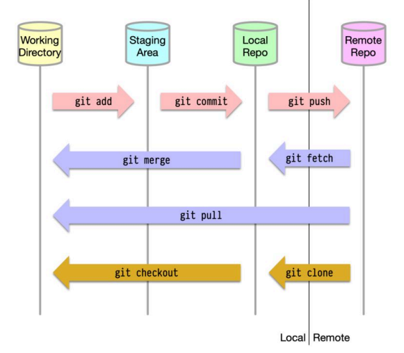
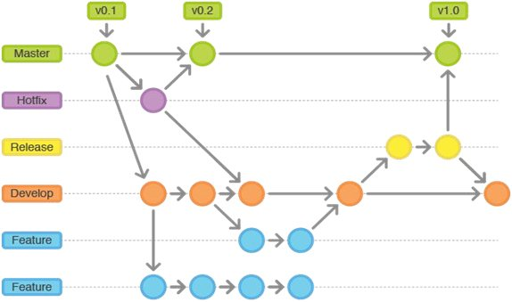
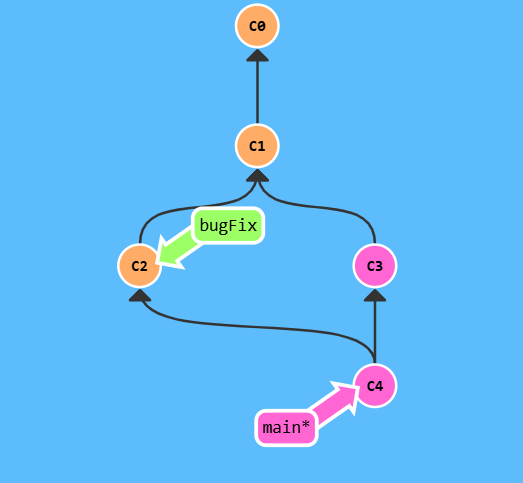
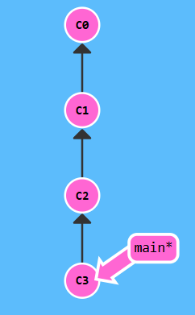
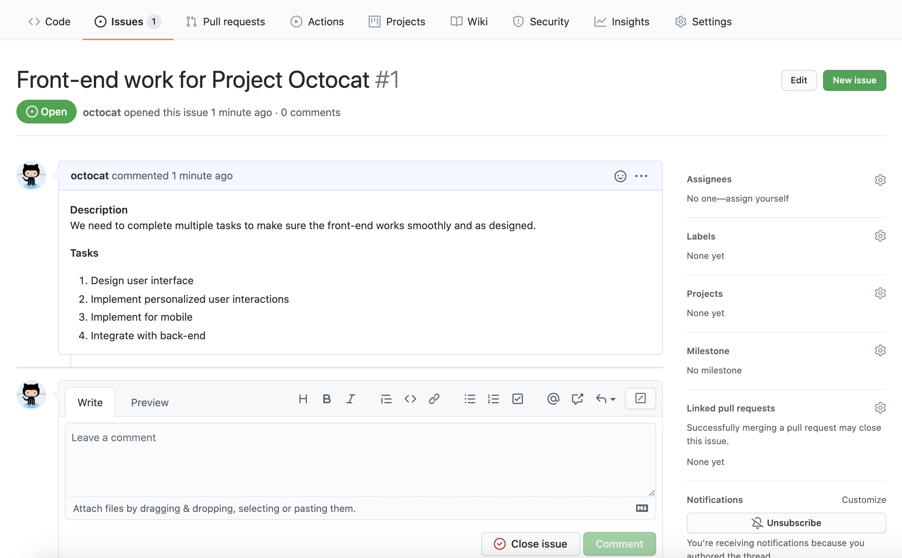
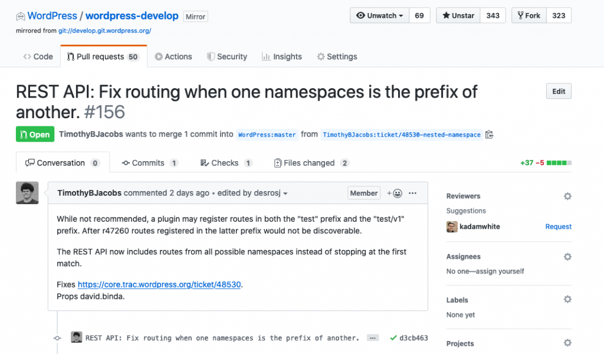
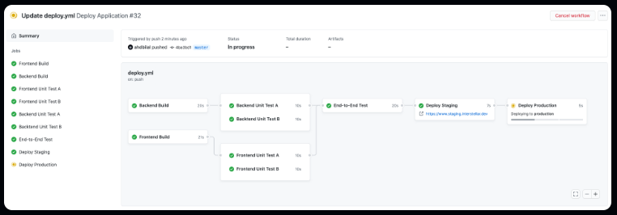

# Git , GitHub & GitHub Actions Study

**Git Installation Guides**: [Git Guides Install Git](https://github.com/git-guides/install-git), [Git SCM Downloads](https://git-scm.com/downloads)

**Resources**:
- [Git tutorial](https://learngitbranching.js.org/)
- Git Cheat Sheets: From [Gitlab](https://about.gitlab.com/images/press/git-cheat-sheet.pdf), [GitHub](https://education.github.com/git-cheat-sheet-education.pdf), [GeekforGeeks](https://www.geeksforgeeks.org/git-cheat-sheet/), [DataCamp](https://www.datacamp.com/cheat-sheet/git-cheat-sheet), [Freecodecamp](https://www.freecodecamp.org/news/git-cheat-sheet/), [GitHub Action](https://github.github.io/actions-cheat-sheet/actions-cheat-sheet.pdf)
- [Git and GitHub for Beginners - Crash Course](https://www.youtube.com/watch?v=RGOj5yH7evk)
- [Git Tutorial for Beginners: Learn Git in 1 Hour](https://www.youtube.com/watch?v=8JJ101D3knE)
- [How Git Works: Explained in 4 Minutes](https://www.youtube.com/watch?v=e9lnsKot_SQ)
- [Git MERGE vs REBASE](https://www.youtube.com/watch?v=0chZFIZLR_0)
- [Git & GitHub Crash Course 2025](https://www.youtube.com/watch?v=vA5TTz6BXhY)
- [Git & GitHub Tutorial | Visualized Git Course for Beginner & Professional Developers in 2024](https://www.youtube.com/watch?v=S7XpTAnSDL4)
- [Philomatics's git merge/pull tutorial](https://www.youtube.com/watch?v=DloR0BOGNU0) (I also recommend the channel for specific Git stuff)
- [13 Advanced (but useful) Git Techniques and Shortcuts](https://www.youtube.com/watch?v=ecK3EnyGD8o)
- [Git for Professionals Tutorial - Tools & Concepts for Mastering Version Control with Git](https://www.youtube.com/watch?v=Uszj_k0DGsg)
- [Learn Git - The Full Course with **The Primeagen**](https://www.youtube.com/watch?v=rH3zE7VlIMs)
- [Advanced Git Tutorial - Interactive Rebase, Cherry-Picking, Reflog, Submodules and more](https://www.youtube.com/watch?v=qsTthZi23VE)
- [GitHub Actions CI/CD - Everything you need to know to get started](https://www.youtube.com/watch?v=mFFXuXjVgkU)
- [GitHub Actions CI/CD Pipeline](https://www.youtube.com/watch?v=a5qkPEod9ng)
- [GitHub Actions Tutorial | From Zero to Hero in 90 minutes](https://www.youtube.com/watch?v=TLB5MY9BBa4)
- [GitHub Actions (Branch Protection, Automated Testing) - 30m Tutorial](https://www.youtube.com/watch?v=UEOtZvTCmDo)
- [GitHub Actions Certification](https://www.youtube.com/watch?v=Tz7FsunBbfQ)

**Paid resources**:
- [Git Complete: The definitive, step-by-step guide to Git](https://www.udemy.com/course/git-complete/?srsltid=AfmBOopP3iB-s05mNLVugOkKm4R3PwywHTntQSbdR60XlTyjjRSi1xox&couponCode=ST7MT290425G1)
- [Git & GitHub - The Practical Guide](https://www.udemy.com/course/git-github-practical-guide/?srsltid=AfmBOoruLaMobaA7BERHJVL0yB8bR1wtTPcvRiLPHt-0rFHEusIhXZTk&couponCode=2021PM20)
- [The Git & Github Bootcamp](https://www.udemy.com/course/git-and-github-bootcamp/?srsltid=AfmBOopCu2lIuJRf-8oKIm1wuMUZwhPxCZWXt3RI42XCkRpooHJZZGCE&couponCode=2021PM20)
- [GitHub Actions - The Complete Guide](https://www.udemy.com/course/github-actions-the-complete-guide/?srsltid=AfmBOooGaVDiX1XJ26k68u18sMqBcusF3fijU9nV1EwqcqkwUg_8P2jY&couponCode=2021PM20)
- [The Complete GitHub Actions & Workflows Guide](https://www.udemy.com/course/github-actions/?srsltid=AfmBOorg-v3C1SmlFr0gitghaUveo_V60LgbfitVLsZZmcktqOZ8eiNi&couponCode=2021PM20)
- [GitHub Actions Certification - Practice Exams](https://www.udemy.com/course/github-actions-practice-exams/?srsltid=AfmBOopqUhUZ3wWFnMLt2gnWUTi_gYUlvcUvSDgvHTdvfaHJE9l7gPg_&couponCode=2021PM20)


**Tools**: [GitKraken Git GUI](https://www.gitkraken.com/), [SourceTree](https://www.sourcetreeapp.com/), [GitHub Desktop](https://desktop.github.com/download/), [Git Bash](https://gitforwindows.org/)

**GitHub Alternatives**: [GitLab](https://about.gitlab.com/), [Bitbucket](https://bitbucket.org/product)

**Documentation**: [Git Docs](https://git-scm.com/docs/git)

**Table of Contents**:

- [Git , GitHub \& GitHub Actions Study](#git--github--github-actions-study)
  - [What is Git?](#what-is-git)
  - [What is GitHub?](#what-is-github)
  - [GitHub Workflow](#github-workflow)
  - [What is a Git remote?](#what-is-a-git-remote)
  - [What is a Git repository?](#what-is-a-git-repository)
  - [What is branching?](#what-is-branching)
  - [Git vs SVN vs ClearCase](#git-vs-svn-vs-clearcase)
    - [Brief Overview](#brief-overview)
    - [Architecture and Design Philosophy](#architecture-and-design-philosophy)
    - [Feature-by-Feature Comparison](#feature-by-feature-comparison)
    - [Strengths and Weaknesses](#strengths-and-weaknesses)
    - [Use Case Suitability](#use-case-suitability)
    - [Adoption Trends](#adoption-trends)
  - [Commands](#commands)
    - [Example of workflow to push a code into the branch while ensuring that you have retrieved the last version of code before pushing:](#example-of-workflow-to-push-a-code-into-the-branch-while-ensuring-that-you-have-retrieved-the-last-version-of-code-before-pushing)
    - [Example of code integration of some branches workflow:](#example-of-code-integration-of-some-branches-workflow)
    - [Workflow for delivery code changes](#workflow-for-delivery-code-changes)
  - [Configuring Git](#configuring-git)
    - [Configure how Git should handle end of lines](#configure-how-git-should-handle-end-of-lines)
  - [Git Staging Area](#git-staging-area)
  - [Git Commits](#git-commits)
    - [Committing Best Practices](#committing-best-practices)
  - [Git Branches](#git-branches)
  - [Git Rebase](#git-rebase)
  - [HEAD](#head)
  - [Relative refs](#relative-refs)
    - [Types of relative commits/refs](#types-of-relative-commitsrefs)
      - [Moving upwards one commit at a time with Caret (^) operator:](#moving-upwards-one-commit-at-a-time-with-caret--operator)
      - [Moving upwards a number of times with Tilde operator (~)](#moving-upwards-a-number-of-times-with-tilde-operator-)
    - [Branch forcing](#branch-forcing)
  - [Reversing Changes in Git](#reversing-changes-in-git)
    - [Git Reset](#git-reset)
    - [Git Revert](#git-revert)
  - [Git Interactive Rebase](#git-interactive-rebase)
  - [Git Tags](#git-tags)
  - [Git fetch](#git-fetch)
  - [Git Merge Conflicts](#git-merge-conflicts)
  - [Remote tracking](#remote-tracking)
    - [Common Remote Tracking Scenarios](#common-remote-tracking-scenarios)
      - [Cloning a Repository](#cloning-a-repository)
      - [Fetching Remote Changes](#fetching-remote-changes)
      - [Pulling Changes (Fetch + Merge/Rebase)](#pulling-changes-fetch--mergerebase)
      - [Creating a Local Branch from a Remote Tracking Branch](#creating-a-local-branch-from-a-remote-tracking-branch)
    - [Tracking Relationships](#tracking-relationships)
    - [Deleting Remote Tracking Branches](#deleting-remote-tracking-branches)
    - [Real-World Example Workflow](#real-world-example-workflow)
  - [GitHub Forking](#github-forking)
  - [GitHub Issues](#github-issues)
  - [Pull Request](#pull-request)
  - [Git Credential Manager](#git-credential-manager)
  - [GitHub Actions (link to docs)](#github-actions-link-to-docs)
    - [GitHub Actions Workflow Syntax](#github-actions-workflow-syntax)
    - [Storing Custom Actions in Repositories \& Sharing with others](#storing-custom-actions-in-repositories--sharing-with-others)


## What is Git?

Git is a free, distributed and open source **version control system**. A version control is the management of changes to documents, programs, files, large web sites, etc. It records the changes made to our code over time in a special database called **repository**. It also provides the history of all changes that were made and the author of those changes. It facilitates the collaborative work between developers.

## What is GitHub?

GitHub is a website to host your repositories and manage your code online. It is used for version control and collaboration. GitHub offers collaboration features like bug tracking, feature requests, task management, etc.

## GitHub Workflow

**GitHub Dev common workflow from ByteByteGo.com**



**GitHub SLDC Workflow from [Nexus Link Services](https://nexuslinkservices.com/git-workflow-in-software-development-life-cycle/)**



## What is a Git remote?

A [remote repository](https://git-scm.com/book/ms/v2/Git-Basics-Working-with-Remotes) in Git, also called a remote, is a Git repository (or version of you project) that’s hosted on the Internet or another network. To be able to collaborate on any Git project, you need to know how to manage your remote repositories. You can have several of them, each of which generally is either read-only or read/write for you. Collaborating with others involves managing these remote repositories and pushing and pulling data to and from them when you need to share work. In contrast to a **local repository**, a **remote** typically does not provide a file tree of the project's current state. Instead, it only consists of the **.git** versioning data.

## What is a Git repository?

A repository is the folder/place where your project is kept. There you can store you code, your files, and each file's revision history  The local repository can be found in `.git` folder. The repository tracks all changes made to files in your project, building a history over time. Meaning, if you delete the .git/ folder, then you delete your project’s history. Repositories can have multiple collaborators and can be either *public* or **private**.

## What is branching?

[Branching](https://git-scm.com/book/en/v2/Git-Branching-Branches-in-a-Nutshell#:~:text=Branching%20means%20you%20diverge%20from,long%20time%20for%20large%20projects.) means you diverge from the main line of development and continue to do work without messing with that main line. Git allows you to create many branches, but you are in charge to manage them.

In working teams, you need a written best practice of how work is structured in the team to avoid mistakes and/or collisions. The branching workflow depends of several parameters: team size, project complexity, release management, etc. It is useful to set a standard so that everyone (especially the new team members) can follow during development.

Examples of Git branching strategies/workflows: [Flow used in enterprise](https://nvie.com/posts/a-successful-git-branching-model/), [Giflow vs GitHub Flow vs GitLab Flow](https://www.eisquare.co.uk/blogs/how-to-choose-your-branching-strategy), [Git Flow Workflow](https://www.gitkraken.com/learn/git/git-flow), [GitHub flow docs](https://docs.github.com/en/get-started/using-github/github-flow)

## Git vs [SVN](https://tortoisesvn.net/) vs [ClearCase](https://www.ibm.com/docs/en/integration-designer/8.5.5?topic=systems-working-clearcase)

### Brief Overview


| System        | Type                   | Initial Release | License        | Target Audience                         |
|---------------|-------------------------|-----------------|----------------|-----------------------------------------|
| Git           | Distributed VCS          | 2005            | Open Source    | General-purpose, DevOps, Open Source    |
| SVN (Subversion) | Centralized VCS       | 2000            | Open Source    | Enterprise teams, legacy applications   |
| ClearCase     | Centralized/Distributed (MultiSite) | 1992 | Commercial (IBM) | Large enterprises, regulated industries |

---

### Architecture and Design Philosophy

| Aspect                    | Git                                     | SVN                                    | ClearCase                              |
|----------------------------|----------------------------------------|---------------------------------------|----------------------------------------|
| Architecture               | Fully distributed                     | Centralized                           | Centralized with distributed features (MultiSite) |
| Data Storage               | Snapshot-based (whole repo)            | File/directory-based deltas           | File system-based (MVFS)               |
| Branching and Merging      | Extremely lightweight and fast         | Supported but heavier and slower      | Complex but highly granular            |
| Offline Work               | Full offline capability                | Limited (requires connection for many actions) | Very limited offline capability         |
| Design Philosophy          | Freedom, decentralization, speed      | Controlled, centralized collaboration | High control, traceability, enterprise integration |

---

### Feature-by-Feature Comparison

| Feature                   | Git                          | SVN                         | ClearCase                       |
|----------------------------|-------------------------------|------------------------------|---------------------------------|
| Architecture               | Fully distributed            | Centralized                 | Centralized with distributed support |
| Performance (small teams)  | Very fast                     | Moderate                    | Slow (heavy-weight)             |
| Performance (large teams)  | Scales well                   | Bottlenecks with scaling     | High resource consumption       |
| Branching/Merging          | Very fast and cheap branches  | Expensive, complex merging   | Fine-grained but complex        |
| Offline Work               | Full capabilities             | Limited (must be connected)  | Very limited                    |
| Learning Curve             | Moderate to steep             | Relatively easy              | Very steep                      |
| Security                   | Good with external tools      | Good                        | Very strong built-in            |
| Tooling and Ecosystem      | Massive (GitHub, GitLab, etc.) | Good (Apache support)        | Proprietary IBM integrations    |
| Cost                       | Free and open source          | Free and open source         | Expensive licensing             |
| Suitable for               | Agile, Open Source, DevOps     | Small to medium enterprises  | Large enterprises, regulated sectors (finance, defense, aerospace) |

---

### Strengths and Weaknesses

| System     | Strengths                                                                                                                                                   | Weaknesses                                                                                                            |
|------------|--------------------------------------------------------------------------------------------------------------------------------------------------------------|-----------------------------------------------------------------------------------------------------------------------|
| Git        | - Superior branching and merging<br>- Very high speed<br>- Robust offline functionality<br>- Massive ecosystem and tooling                                 | - Complex history rewriting<br>- Steep learning curve for newcomers                                                  |
| SVN        | - Simpler centralized model<br>- Easy access control management<br>- Historically better binary file handling                                               | - Weak offline capabilities<br>- Clunky branching and merging<br>- Single point of failure (central server)           |
| ClearCase  | - Deep, fine-grained version control<br>- Strong integration with critical enterprise environments<br>- Enterprise-grade security and auditing capabilities | - High resource demands<br>- Complex to administer<br>- Expensive<br>- Very slow compared to modern alternatives      |

---

### Use Case Suitability

| Use Case                         | Recommended Version Control System (VCS)    |
|-----------------------------------|--------------------|
| Open-source project              | Git                |
| Small to medium business project | SVN or Git         |
| Highly regulated industry (defense, banking, aerospace) | ClearCase (or Git + custom compliance layers) |
| DevOps / CI/CD environments       | Git                |
| Projects with very large binaries | ClearCase or specialized Git-LFS setups |

---

### Adoption Trends

- **Git** is now the industry standard for modern development practices.
- **SVN** is declining but remains in use for legacy and simple enterprise applications.
- **ClearCase** is steadily declining except in industries with regulatory or historical lock-in (often being replaced by Git with strict governance models).

---

## Commands

Check Git version:
```
git --version
```

Help command (to see the supported commands and flags):
```
git help

# or

git <command> help
```

To check the status of the project:
```
git status
```

To checkout/switch to another branch:
```
git checkout someBranch
```

To check the current branch you are working:
```
git branch
```

To create a new branch:
```
git branch newBranch
```

To create and checkout to a new branch at the same time:
```
git checkout -b newBranch
```

**Note**: In Git *version 2.23*, a new command called `git switch` was introduced to eventually replace `git checkout`, which is somewhat overloaded (it does a bunch of different things depending on the arguments). [Learn more here](https://git-scm.com/docs/git-switch).

To delete a branch locally:
```
git branch -d oldBranch
```

To force delete a branch locally:
```
git branch -D oldBranch
```

To delete a remote branch:
```
git push origin --delete oldBranch
```

**OR**:

```
git push origin :oldBranch
```

To add/stage/track files and changes in Git:
```
git add file.txt
```

**Note**: You can use patterns like `*.txt` to add all files with `txt` extension or you can add the entire directory recursively `git add .`.

To list the staged files:
```
git ls-files
```

To remove staged files:
```
git restore --staged <pathspec>
```

To remove the file from working directory and from the staging area:
```
git rm file.txt
```

To commit in GitHub:
```
git commit
```

To commit with a message in Git:
```
git commit -m"initial commit"
```

To modify the commit with a new message:
```
git commit --amend -m "True commit!"
```

To merge 2 branches in Git:
```
# from main branch
git merge branchToBeMerged
```

**Note**: Merging in Git creates a special commit that has two unique parents. A commit with two parents essentially means "I want to include all the work from this parent over here and this one over here, and the set of all their parents."



To rebase a branch into main:
```
# from featureBranch
git rebase main
```

**Note**: This command will move the work from `featureBranch` directly onto the work from main. To make sure that the main branch is updated it is needed to `git checkout main` then `git rebase featureBranch`.


To see the tree visualization with commit (with their specific hashes) history:
```
git log
```

**Note**: Hashes are usually a lot longer in the real Git world as well. For instance, a hash of some commit could be `fed2da64c0efc5293610bdd892f82a58e8cbc5d8`. The good thing is that Git is smart about hashes. It only requires you to specify enough characters of the hash until it uniquely identifies the commit. So you can type `fed2` instead of the long string above (This is similar to how Docker identifies the Docker images or containers).

To see a short summary of commit history:
```
git log --oneline
```

To filter your commit history using `git log`:
```
git log --after="2021-7-1" # Retrieve the commits that are after 1-7-2021

git log --after="2021-7-1" --before "2021-7-6" # Retrieve commits that are between 1-7-2021 and 6-7-2021

git log --grep="refactor" # Retrive commits that contains 'refactor' in their title/message (you can use regex)

git log --author="Someone" # Retrieve Someone's commits

git log -- README.md # Retrieve all the commits that modified the README.md files

git log feature/login..main # Retrieve the commits that are in main branch, but not in the feature/login branch

```

To reverse changes in Git:
```
# locally (it will discard the commits from the local repository)
git reset <commit-hash>
# or remotely (it will create a new commit on top of the existing ones)
git revert <commit-hash>
```

**Note**: By default `git reset` is doing a mixed reset, i.e is undoing (deleting) the commit and the staged changes, but it keeps the modified code in the Working Directory (in case you want to stage them back) as unstaged changes.

To **SOFT** reset changes in Git:
```
git reset --soft HEAD~1
```

**Note**: This command will undo (delete) the last commit but keep the staged changes (it doesn't preserve your changes in the Working Directory)

To **HARD** reset changes in Git:
```
git reset --hard HEAD~1
```

**Note**: This command will undo (delete) the last commit, the staged changes and also your unstaged changes from working directory. Basically it will reset everything to the last commit. If you messed up the hard reset, you can undo this type of reset(yay!). More details [here](https://stackoverflow.com/questions/5473/how-can-i-undo-git-reset-hard-head1).

To copy a series of commits below your current location (`HEAD`):
```
git cherry-pick <Commit1> <Commit2> <...>
```

**Note**: This is a more straightforward way to copy some work on another branch than using rebase. Also, `git cherry-pick` is useful when you know what commit you need.

To check what where the HEAD is pointing ([resource](https://stackoverflow.com/questions/1967967/git-command-to-display-head-commit-id)):
```
git rev-parse --short HEAD
# or
git log -1
# or
git show HEAD
```

To rebase a separate branch:
```
git rebase main anotherBranch
```

To rebase the last N commits:
```
git rebase -i HEAD~N
```

**Note**: The above command will open an editor window session in Interactive Rebase mode (the editor can be set via `git config --global core.editor <editor_window>`). You can also use rebase to clean up your local commit history before merging it into a shared team branch (or remote repo).

To modify commit:
```
git commit --amend
```

To create a tag around a specific commit:
```
git tag <tag_name> <commit_id>
```

To describe where you are relative to the closest "anchor" (aka tag):
```
git describe <ref>
```

**Note**: The output of `git describe command` looks like: `<tag>_<numCommits>_g<hash>`, where `tag` is the closest ancestor tag in history, `numCommits` is how many commits away that tag is, and `hash` is the hash of the commit being described.

To clone a repository locally (or to create local copies of remote repos):
```
git clone <url>
```

To initialize a local repository:
```
git init
```

**Note**: This will create a new hidden folder called `.git` that will serve as your local repository that can connect to a remote one.

To fetch data from a remote repository:
```
git fetch
```

**Note**: `git fetch` doesn't modify you local branches. To update you local branches you have to run `git merge`.

**Note2**: you can add some arguments: `git fetch origin`, `git fetch origin featureBranch`, `git fetch origin <source>:<destination>`, where `source` is a branch on the remote and `destination` is a local branch to add the commits. If you don't add any `source`, git will actually create a new branch.


To pull data (`git fetch` + `git merge`) from a remote repository:
```
git pull
```

**Note**: Remote branches are on your local repository, not on the remote repository.

To pull and rebase (`git fetch` + `git rebase`) from a remote repository:
```
git pull --rebase
```

**Note**: It is useful for scenarios where you have some commits locally (C0 -> C1 -> C3), but the remote repo has different commits (C0 -> C1 -> C2) which would be a reason why `git push` fails. The above command will retrieve the commit the different commits from remote repo (C2) and then will add C3 on top of the local commits. The output will be `C0 -> C1 -> C2 -> C3'` where C3' = C3.

To push or publish you changes on a remote repository:
```
git push
# git push origin featureBranch
```

**Note**: The behavior of git push with no arguments varies depending on one of git's settings called `push.default`. You can also specify the source and the destination of the branch you want to push by using colon refspec `git push origin <source>:<destination>`.

**Tip**: Never use `git pull origin main --force` because this command will overwrite the remote commit with the state of your local code. If there are commits on the remote branch that you don't have, you will lose them forever:(

*Equivalent commands* in Git:
```
git pull origin foo is equal to:

git fetch origin foo; git merge o/foo

---------------------------------------------

git pull origin bar:bugFix is equal to:

git fetch origin bar:bugFix; git merge bugFix
```

To checkout a new branch locally and set a remote branch track target:
```
git checkout -b feature origin/feature
```

**Note**: You can achieve the same thing if you use `git branch -u origin/feature feature` or simply `git branch -u origin/feature` if you already checkout out the feature branch.

To check the remote repository:
```
git remote
# or git remote -v for more details
```

To connect a local repository to a remote repository:
```
git remote add origin <url>
```

To see all your local changes since you last committed:
```
git diff
```

**Note**: You can use `--staged` flag to see what code do you have in the staging area.

To compare 2 branches to each other:
```
git diff branch1 branch2
```

To use visual diff tools:
```
git config --global diff.tool vscode

git config --global difftool.vscode.cmd "code --wait --diff $LOCAL $REMOTE"

git config --global -e # To check the configuration

git difftool --staged
```

To take your uncommited changes, save them away for later use, and then reverts them from your working copy (or simply [stash](https://git-scm.com/docs/git-stash) your changes):
```
git stash
```

To apply the stashed changes:
```
git stash pop
```

To save the stash in a separate location:
```
git stash save something
```

To list all the created stashes:
```
git stash list
```

To apply the created stash:
```
git stash apply <index>
```

To record when the tips of branches and other references were updated in the local repository ([Reference log/reflog](https://git-scm.com/docs/git-reflog)):
```
git reflog
```

**Note**: It is useful for scenarios where you want to recover some deleted commits or branches.

### Example of workflow to push a code into the branch while ensuring that you have retrieved the last version of code before pushing:
```
git fetch
git rebase origin/main # or git merge origin/main or directly git pull
git add <files>
git commit -m"message"
git push origin branch
```

### Example of code integration of some branches workflow:
```
# with rebase => cleaner history but the commits will be modified
git fetch
git rebase origin/main featureBranch1
git rebase featureBranch1 featureBranch2
git rebase featureBranch2 featureBranch3
git rebase featureBranch3 main
git push origin main
```

```
# with merge => all changes history is visible but it will be spaghetti commits
git checkout main
git pull --rebase
git merge featureBranch1
git merge featureBranch2
git merge featureBranch3
git push origin main

```

### Workflow for delivery code changes

```
git clone <url> <location>
git checkout -b <my-branch-from-the-main>
# Make your changes
git add <files>
git commit -m"Add feature"
git push origin <my-branch-from-the-main>
# Open a Pull Request and merge the changes
# Or if you don't use GitHub => git checkout main => git merge <my-branch-from-the-main> => git commit => git push origin main (make sure that you solve the merge conflicts if needed)
git checkout main
git pull
# Then repeat from the second command
```

## Configuring Git

There are several things you can [configure](https://git-scm.com/book/en/v2/Customizing-Git-Git-Configuration):

- name
- email
- default editor
- line ending

Those settings can be applied on the following levels:
- system (all users of the machine)
- global (all repos of the current user)
- local (the current repository)

To configure Git globally:
```
git config --global user.name "PatrickDiallo23"

git config --global user.email "something@gmail.com"

git config --global -e # this will open the default code editor with .gitconfig file
```

### Configure how Git should handle end of lines

On Windows, the end of lines are marked with 2 special characters: \r (Carriage Return), \n (Line Feed), meanwhile on MacOS/Linux the end on lines are marked with only \n (Line Feed). If you don't have a way to handle the end of lines, you can run into some issues on the long run. You can configure the default behaviour via `core.autocrlf`.

```
git config --global core.autocrlf true # if you are on Windows
git config --global core.autocrlf input # if you are on MacOS/Linux
```

You can also more details on [Atlassian](https://www.atlassian.com/git/tutorials/setting-up-a-repository/git-config).

## Git Staging Area

It is the index or the place where the proposed files for the commit are added before committing. You can add files into the staging area by `git add file.txt`.

You can also configure `gitignore` file(s) is to ensure that certain files not tracked by Git remain untracked so they are not committed. The `.gitignore`file looks like this:

```
### Java .gitignore file template###
# Compiled class file
*.class

# Log file
*.log

# BlueJ files
*.ctxt

# Mobile Tools for Java (J2ME)
.mtj.tmp/

# Package Files #
*.jar
*.war
*.nar
*.ear
*.zip
*.tar.gz
*.rar
```

More details you can find on [Git Documentation](https://git-scm.com/docs/gitignore), GitHub Documentation(https://docs.github.com/en/get-started/git-basics/ignoring-files), [gitignore templates](https://github.com/github/gitignore) or [gitignore templates generator](https://www.toptal.com/developers/gitignore).

## Git Commits

A commit in a git repository records a snapshot of all the (tracked) files in your directory.

Git wants to keep commits as lightweight as possible though, so it doesn't just blindly copy the entire directory every time you commit. It can (when possible) compress a commit as a set of changes, or a "delta", from one version of the repository to the next.

Git also maintains a history of which commits were made when. That's why most commits have ancestor commits above them. Maintaining history is great for everyone working on the project!



### Committing Best Practices

- Use present tense ("Add feature")
- Use the imperative mood ("Move cursor to..." not "Moves cursor to...")
- Reference issues and pull requests after the first line
- Use descriptive commit messages
- Avoid commit generated files (from a compile build for example)
- Use [Conventional Commits](https://www.conventionalcommits.org/en/v1.0.0/) for PR titles and commit messages. Also, there some prefixes allowed: `feat`, `fix`, etc.

Resources: [Git Commit Best Practices](https://gist.github.com/luismts/495d982e8c5b1a0ced4a57cf3d93cf60), [10 essential practices for better commits](https://medium.com/@saeid/10-essential-practices-for-better-git-commits-and-why-they-matter-3cfc420bf53e)

**Note**: The best practices depend on your team/project standards. The above information is indicative only. You can also search for `commit best practices` on Google.

## Git Branches

Branches in Git are incredibly lightweight as well. They are simply pointers to a specific commit. You can think of them as alternative code versions.

Because there is no storage / memory overhead with making many branches, it's easier to logically divide up your work than have big beefy branches.

## Git Rebase

The another way of combining work between branches (besides merging) is rebasing. Rebasing essentially takes a set of commits, "copies" them, and plops them down somewhere else.

The advantage of rebasing is that it can be used to make a nice linear sequence of commits. The commit log / history of the repository will be a lot cleaner if only rebasing is allowed.

## HEAD

First we have to talk about "HEAD". [HEAD](https://stackoverflow.com/questions/2304087/what-is-head-in-git) is the symbolic name for the currently checked out commit -- it's essentially what commit you're working on top of.

HEAD always points to the most recent (or currently) commit/branch which is reflected in the working tree. Most git commands which make changes to the working tree will start by changing HEAD.

Normally HEAD points to a branch name (like bugFix). When you commit, the status of bugFix is altered and this change is visible through HEAD.


**Detaching HEAD** just means attaching it to a commit instead of a branch. This is what it looks like beforehand:

```
HEAD -> main -> C1
```

And now (after `git checkout C1`) it's:

```
HEAD -> C1
```

## Relative refs

[**Relative refs**](https://www.atlassian.com/git/tutorials/refs-and-the-reflog) (relative references) are a shorthand way to refer to commits in Git based on their position in the commit history relative to a known reference point — such as `HEAD` (current commit), a branch, or a tag. These are especially useful for navigating the commit tree without needing to know specific commit hashes.

A common use case is checking out a previous commit, creating a new branch from a few commits ago, or inspecting logs without typing long hashes.

Git allows you to move *backwards* or *upwards* through the commit history using special syntax involving `^` and `~`.

### Types of relative commits/refs

1. `~n` (Tilde Notation)

2. `^n` (Caret Notation)

#### Moving upwards one commit at a time with Caret (^) operator:

Each time you append that to a ref name, you are telling Git to find the parent of the specified commit.

So saying `main^` is equivalent to "the first parent of `main`".

`main^^` is the grandparent (second-generation ancestor) of `main`

To checkout to the previous commit of the main branch:
```
git checkout main^
```

**Specifying Parents (Advanced)**

Like the `~` modifier, the `^` modifier also accepts an optional number after it.

Rather than specifying the number of generations to go back (what `~` takes), the modifier on `^` specifies which parent reference to follow from a merge commit. Remember that merge commits have multiple parents, so the path to choose is ambiguous.

Git will normally follow the "first" (main^ or main^1) parent upwards from a merge commit, but specifying a number with `^` changes this default behavior.

For example:
```
git checkout main^2
```


#### Moving upwards a number of times with Tilde operator (~<num>)

Say you want to move a lot of levels up in the commit tree. It might be tedious to type `^` several times, so Git also has the tilde (`~`) operator.

The tilde operator (optionally) takes in a trailing number that specifies the number of parents you would like to ascend. Let's see it in action.

For example:
```
git checkout HEAD~3
```

**Optional Advanced Note**: You can chain the tilde and Caret modifiers together:
```
git checkout HEAD~^2~2
# equivalent to git checkout HEAD~; git checkout HEAD^2; git checkout HEAD~2
```

More details about the differences between Caret and Tilde operators can be found [here](https://stackoverflow.com/questions/2221658/what-is-the-difference-between-head-and-head-in-git).

### Branch forcing

One of the most common ways you can use relative refs is to move branches around. You can directly reassign a branch to a commit with the `-f` option. The `-f` (force) option lets you move a branch pointer to a specific commit, even if it rewrites history or discards commits. So something like:

```
git branch -f main HEAD~3 # git branch -f <branch-name> <target-commit>
```

moves (by force) the main branch to three parents behind HEAD.

This will look like the following:

Before branch forcing:
```
A---B---C---D---E (main)
```

After branch forcing:
```
A---B (main)
```

It rewires main to point to commit `B`, effectively removing `C`, `D`, and `E` from main. You haven't lost commits `C`, `D`, and `E`, but they’re now "dangling" unless you have another reference pointing to them (like a tag or another branch).

**Note**: In a real git environment `git branch -f command` is not allowed for your current branch.

Why is branch forcing useful?

- Useful for rewriting history (e.g., rebasing manually)
- Recover from bad merges or resets
- Align branch pointers during reorganization or cleanup
- Repoint feature branches without checking them out

## Reversing Changes in Git

There are many ways to reverse changes in Git. And just like committing, reversing changes in Git has both a low-level component (staging individual files or chunks) and a high-level component (how the changes are actually reversed).


There are two primary ways to undo changes in Git -- one is using `git reset` and the other is using `git revert`.

### Git Reset

`git reset` reverses changes by moving a branch reference backwards in time to an older commit. In this sense you can think of it as "rewriting history;" `git reset` will move a branch backwards as if the commit had never been made in the first place.

### Git Revert

While resetting works great for local branches on your own machine, its method of "rewriting history" doesn't work for remote branches that others are using.

In order to reverse changes and *share* those reversed changes with others, we need to use `git revert`.

## Git Interactive Rebase

It's a feature that lets you reviewing a series of commits you're about to rebase. All interactive rebase means is that Git is using the `rebase` command with the `-i` option.

If you include this option, git will open up a UI (a file in a text editor on Terminal like `vim`) to show you which commits are about to be copied below the target of the rebase. It also shows their commit hashes and messages.

Example (this will rebase the last 3 commits):
```
git rebase -i HEAD ~3
```

**Note**: Git interactive rebase you can do many (more) things like, picking the commit you want to be included, squashing (combining) commits, amending commit messages, and even editing the commits themselves.

**Pro tip**: There are some cases in the development phase when you are trying to fix a bug. This requires a debug process that would result in many commits. After you solve the bug, you want to copy only the `bug-solution` commit in the main branch. You can do that by using `git rebase -i` and `git cherry-pick`.

## Git Tags

Branches are easy to move around and often refer to different commits as work is completed on them. Branches are easily mutated, often temporary, and always changing.

If that's the case, there's a way to permanently mark historical points in your project's history. For things like major releases and big merges, is there any way to mark these commits with something more permanent than a branch?

Git tags support this exact use case -- they (somewhat) permanently mark certain commits as "milestones" that you can then reference like a branch.

More importantly though, they never move as more commits are created. You can't "check out" a tag and then complete work on that tag -- tags exist as anchors in the commit tree that designate certain spots.

Example:
```
git tag <tag_name> <commit_id>
```

**Note**: The above command will make you go into detached `HEAD` state -- this is because you can't commit directly onto the `<tag_name>` tag.

## Git fetch

`git fetch` performs two main steps. It:

- downloads the commits that the remote has but are missing from our local repository, and...
- updates where our remote branches point (for instance, `origin/main`)

`git fetch` essentially brings our local representation of the remote repository into synchronization with what the actual remote repository looks like (right now).

`git fetch` usually talks to the remote repository through the Internet (via a protocol like http:// or git://).

`git fetch`, however, does not change anything about your local state. It will not update your `main` branch or change anything about how your file system looks right now. To update the `main` branch, you will need to run `git merge`.

## Git Merge Conflicts

Git can handle most merges on its own with automatic merging features. A conflict arises when two separate branches have made edits to the same line in a file, or when a file has been deleted in one branch but edited in the other. Conflicts will most likely happen when working in a team environment. 

Useful resouces can be found below: 
- [Stack Overflow - how-do-i-resolve-merge-conflicts-in-a-git-repository](https://stackoverflow.com/questions/161813/how-do-i-resolve-merge-conflicts-in-a-git-repository)
- [Atlassia - merge conflicts](https://www.atlassian.com/git/tutorials/using-branches/merge-conflicts)
- [GitHub Docs](https://docs.github.com/en/pull-requests/collaborating-with-pull-requests/addressing-merge-conflicts/resolving-a-merge-conflict-using-the-command-line)
- [Simplilearn - merge conflicts in git](https://www.simplilearn.com/tutorials/git-tutorial/merge-conflicts-in-git)
- [Medium article related to git merge conflicts](https://medium.com/@amitmishraam941/mastering-merge-conflict-resolution-in-git-a-complete-guide-for-developers-5e0b3443cfd9)


## Remote tracking

**Remote tracking branches** act as pointers to the state of branches in a remote repository and help keep local and remote work in sync without confusion.

A remote tracking branch is a local reference to a branch in a remote repository. It reflects the state of that remote branch the last time it was fetched or pulled.

They are **read-only** and typically named in the format:
```
<remote-name>/<branch/name> # For example origin/main
```

**Note**: This means:

> The **branch/name** (main) branch as it exists on the remote named **remote-name** (origin).

You cannot directly commit to a remote tracking branch, but you can merge, rebase, or create a local branch from it.

### Common Remote Tracking Scenarios

#### Cloning a Repository

When you clone a repo, Git automatically:

- Creates a remote named `origin`.

- Sets up remote tracking branches like `origin/main`.

- Creates a local branch (`main`) that tracks `origin/main`.

```
git clone https://github.com/user/repo.git
```

You now have:

- `main` (local branch)

- `origin/main` (remote tracking branch)

#### Fetching Remote Changes

```
git fetch
```

This updates your remote tracking branches (like `origin/main`) **without modifying your working files or local branches**.

To see what changed on the remote without merging:

```
git log main..origin/main
```

#### Pulling Changes (Fetch + Merge/Rebase)

```
git pull
```

This command fetches updates and **merges them into your current branch**. It works only if your branch is configured to track a remote branch (e.g., `main` tracking `origin/main`).

#### Creating a Local Branch from a Remote Tracking Branch

If a remote has a branch you don’t yet track locally:

```
git checkout -b feature-x origin/feature-x
```

This creates a new local branch (`feature-x`) that starts from and tracks `origin/feature-x`.


### Tracking Relationships

You can view which branch tracks what using:

```
git branch -vv
```

Example output:

```
* main     9fceb02 [origin/main] Add final version of index.html
```

To change a tracking relationship:

```
git branch --set-upstream-to=origin/feature-x feature-x
```

### Deleting Remote Tracking Branches

Remote tracking branches can become stale when a branch is deleted from the remote.

Use:

```
git fetch --prune
```

This removes local references to branches deleted from the remote.

Or, for Git 2.17+:

```
git remote prune origin
```

### Real-World Example Workflow

```
git clone https://github.com/org/project.git
cd project

# work on main, which tracks origin/main
git fetch                 # update origin/*
git status
git pull                  # fetch + merge changes into main

# create and push new feature
git checkout -b feature-x
git push -u origin feature-x  # sets up tracking: feature-x → origin/feature-x

```

More info can be found below:
- [Git Branching Remote Branches](https://git-scm.com/book/en/v2/Git-Branching-Remote-Branches)
- [Git Remote](https://git-scm.com/docs/git-remote).
- [Git Fetch](https://git-scm.com/docs/git-fetch)
- [Git Branch](https://git-scm.com/docs/git-branch)
- [Git Pull](https://git-scm.com/docs/git-pull)
- [Git Checkout](https://git-scm.com/docs/git-checkout)

## GitHub Forking

A [fork](https://docs.github.com/en/pull-requests/collaborating-with-pull-requests/working-with-forks/about-forks) is a new repository that shares code and visibility settings with the original `upstream` repository. To do a fork you can follow this [guide](https://docs.github.com/en/pull-requests/collaborating-with-pull-requests/working-with-forks/fork-a-repo).

## GitHub Issues

GitHub Issues is a lightweight issue-tracking system that is available in all GitHub repositories. When you create a GitHub repo, you get GitHub Issues out of the box, and more often than not, you keep using it as your project evolves. In most cases, GitHub Issues is used for reporting bugs and requesting features.



More info [here (GitHub Issue best practices)](https://rewind.com/blog/best-practices-for-using-github-issues/#:~:text=GitHub%20Issues%20is%20a%20lightweight,reporting%20bugs%20and%20requesting%20features.) and [here (Create an issue)](https://docs.github.com/en/issues/tracking-your-work-with-issues/using-issues/creating-an-issue).

## Pull Request

In real life, you can't directly push into the `main` because of the project's standards or because you don't want to risk pushing bad code in main/production. So you will have to create a [**Pull Request**](https://docs.github.com/en/pull-requests/collaborating-with-pull-requests/proposing-changes-to-your-work-with-pull-requests/about-pull-requests) (PR) to merge the changes in the `main`. Create another branch called `feature` and push that to the remote. Also reset your main back to be in sync with the remote otherwise you may have issues next time you do a pull and someone else's commit conflicts with yours. A PR is a request to add changes from a branch to another branch. With PR it is possible to review code, comment on code snippets, propose changes and so on.



More info [here](https://docs.github.com/en/pull-requests/collaborating-with-pull-requests/proposing-changes-to-your-work-with-pull-requests/creating-a-pull-request).

## Git Credential Manager

[Git Credential Manager](https://github.com/git-ecosystem/git-credential-manager) creates and stores credentials to access Git repositories on a host of platforms. It is built on .NET that runs on Windows, macOS, and Linux. It aims to provide a consistent and secure authentication experience, including multi-factor auth, to every major source control hosting service and platform. More info [here (Git Tools Credential Storage)](https://git-scm.com/book/en/v2/Git-Tools-Credential-Storage) and [here (Git Credentials)](https://git-scm.com/docs/gitcredentials)


## GitHub Actions (link to [docs](https://docs.github.com/en/actions/writing-workflows/quickstart))

GitHub Actions is a Workflow Automation Service Platform developed by GitHub to automate developer workflows/processes (incl. CI/CD pipelines and Code or Repository Management). Those workflows are activated when various `GitHub Events` occur (such as PR created, commit, Issue Created, etc.).  To enable a GitHub Action Workflow, you have to create a `.yml` or `.yaml` file in the `.github/workflows` directory.

The flow is the following:
```
Listen to Event -> Trigger Workflow (or some script) -> that uses Actions

Common workflow (CI/CD pipeline): Commit Code -> Run Tests -> Build artefact(s) -> Push artefact(s) -> Deploy
```

### GitHub Actions Workflow [Syntax](https://docs.github.com/en/actions/writing-workflows/workflow-syntax-for-github-actions)

- **Workflow**: Configurable automated process that will run one or more jobs. It is also possible to use [workflow commands](https://docs.github.com/en/actions/writing-workflows/choosing-what-your-workflow-does/workflow-commands-for-github-actions) for various tasks (setting debug message, environment variable, output parameters, etc.).

- **Actions**: Reusable tasks that perform specific jobs within a workflow.

- **Job**: Group of steps that execute on the same runner (in parallel by default if not configured otherwise).

- **Steps**: Individual tasks within a job that run commands or actions sequentially.

- **Runner**: Server that host the environment where the jobs are executed, available as GitHub-hosted or self-hosted options.

- `name` [optional]: Name of the workflow/job/step; used to describe is doing; it is displayed on your repos action page

- `on` [required]: Name of the [GitHub event(s)](https://docs.github.com/en/actions/writing-workflows/choosing-when-your-workflow-runs/events-that-trigger-workflows) that triggers the GitHub Action/workflow. You can also provide a configuration to manually run the workflows by using `workflow_dispatch` event or to make a workflow callable in a automatic way by using `workflow_call`. To listen on multiple events, insert squared brackets `[]` and add the list of events. (e.g `on: [push, workflow_dispatch]`). Alternatively, you can add the events with the specific config.

```
on:
  push:
    branches:
      - main
  pull_request:
    branches:
      - main
  [other events]
```

- `jobs` [required]: What it is being executed on a specific event. You can have more jobs, provide some steps, name of the specific jobs.

- `step` [required for jobs]: Sequence of tasks, it can run commands, setup tasks, or run an action

- `uses` [optional for jobs]: Selects an [**action**](https://github.com/actions) to perform. The syntax is `actions/<specific_action>`. Note that an action is a repository (check the `action.yml` file to see what is happening in the background). You can also call other workflows (or custom actions) by referencing them: `uses: ./.github/workflows/path_to_workflow.yml`.

- `with` [option]: Provide the action's configuration. You can specify the version of the action you are using (for programming languages). You can also provide environment variables here. `secrets` can be stored on GitHub Repo Settings.

- `run` [optional]: Runs CLI/Terminal Command. You can use pipe `|` to provide multiple commands.

- `needs` [optional]: Reference the job that depends on the current job that you want to run. This way you can run jobs sequentially. It contains the output of the job.

- `runs-on` [required]: Specify in which environment you would like the code/Job to run (Linux - Ubuntu, MacOS, Windows). It is also known as the [**Runner**](https://docs.github.com/en/actions/using-github-hosted-runners/using-github-hosted-runners/about-github-hosted-runners). Every Job has its own Runner. You can also add your own [self-hosted runners](https://docs.github.com/en/actions/hosting-your-own-runners/managing-self-hosted-runners/about-self-hosted-runners).

- `strategy.matrix`: Specify a [Matrix Strategy](https://docs.github.com/en/actions/writing-workflows/choosing-what-your-workflow-does/running-variations-of-jobs-in-a-workflow) to create a configuration for running multiple Jobs with different parameters and combinations of those parameters. For example, you can use a matrix strategy to test your code in multiple versions of a language or on multiple operating systems. To use the matrix add in the Runner the following: `runs-on: ${{ matrix.variable }}`.

	- `include`: A reserved key where you can explicitly **include** values/combinations in a strategy matrix.
	- `exclude`: A reserved key where you can explicitly **exclude** values/combinations in a strategy matrix.		

- `strategy.matrix.os`: Specify that you want to run the code in multiple OS. In the `runs-on` you have to add `${{matrix.os}}`

- `${{ <context> }}`: [Context objects](https://docs.github.com/en/actions/writing-workflows/choosing-what-your-workflow-does/accessing-contextual-information-about-workflow-runs) with valuable information about workflow runs, runners, etc. More details [here](https://graphite.dev/guides/github-actions-contexts). You can also use [Expressions](https://docs.github.com/en/actions/writing-workflows/choosing-what-your-workflow-does/evaluate-expressions-in-workflows-and-actions).

- Activity Types: There are some events that may have different activity types (e.g `pull request` can have `assigned`, or `closed` activity types).

```
on:
  pull_request:
    types: [opened, closed]

# or

on:
  pull_request:
    types:
      - opened
      - closed
```

- Event Filters: Provide more control over your workflow by filtering the events that can trigger a new workflow (e.g you want to deploy an app only when you push on the main branch). Only push, pull_request, and pull_request_target supports filtering.

```
on:
  push:
    branches:
      - main
      - 'dev-*' # dev-new, dev-something
      - `feat/**` # feat/new, feat/new/button
```

- Skipping workflows: You can skip workflows by adding certain strings to  the commit message. More details [here](https://docs.github.com/en/actions/managing-workflow-runs-and-deployments/managing-workflow-runs/skipping-workflow-runs).

- Reusable workflows: You can reuse certain workflows in other workflows without writing the same script over and over again.

- Job Artifacts: GitHub Actions Job's output asset(s) (e.g app binary, website files, etc.). To upload artifact use `actions/upload-artifact` action. To download an artifact generated by another job use `actions/download-artifact`.

- `outputs` - [Job Outputs](https://docs.github.com/en/actions/writing-workflows/choosing-what-your-workflow-does/passing-information-between-jobs): Simple values that are being generated during processing the Jobs (name of the files, secrets, etc.). They let you pass data between jobs in your workflow in a `map` format.

- `id` [optional]: Unique identifier for a specific step within a Job. Useful for Job Outputs or conditionals Jobs/steps.

- [Caching Dependencies](https://docs.github.com/en/actions/writing-workflows/choosing-what-your-workflow-does/caching-dependencies-to-speed-up-workflows): Repetitive steps should be done only once (ideally). This can be done with `actions/cache` action.

-  `env`: Set [Environment Variables](https://docs.github.com/en/actions/writing-workflows/choosing-what-your-workflow-does/store-information-in-variables). It can be added on the workflow level, job level or step level. You can also use `env` to increase workflow security by avoiding having any GitHub Variable Context directly in the shell (from the `run` command). GitHub Actions also provides [default environment variables](https://docs.github.com/en/actions/writing-workflows/choosing-what-your-workflow-does/store-information-in-variables#default-environment-variables) that can be used in the workflow.

- [Secrets](https://docs.github.com/en/actions/security-for-github-actions/security-guides/about-secrets): A secured way to store environment variables. You can set those at the repository level as well. A tutorial on how to use secrets can be found [here](https://docs.github.com/en/actions/security-for-github-actions/security-guides/using-secrets-in-github-actions). You can access the secrets via `${{ secrets.PASSWORD }}` for example (where `PASSWORD` is your secret created in the repo).

- `environment`: Set Repository Environment for specific use cases (production, testing, etc.). You can provide extra configuration during the workflow.

- `if`: Control Workflow execution by adding a condition to run a specific step, or Job. The condition will look like this: `if: failure() && steps.step-id.outcome == 'failure'`. More details about **Special Conditional Functions** can be found [here](https://docs.github.com/en/actions/writing-workflows/choosing-what-your-workflow-does/evaluate-expressions-in-workflows-and-actions#status-check-functions).

- `continue-on-error`: Prevents a job from failing when a step or Job fails (Job Error Handling strategy).

- `inputs`: Adding input data needed by the workflow. You can specify data that the action expects to use during runtime. You can also find `inputs` as a **context object** (`${{ inputs.something }}`) that contains the inputs of a reusable or manually triggered workflow.

- `container`: Run a Job in a (isolated) container inside the Runner. You can also add `image` you want to use to run the container.

- `services`: Docker Containers that can be used to host services that you might need to test or operate your app in a workflow. More info can be found [here](https://docs.github.com/en/actions/use-cases-and-examples/using-containerized-services/about-service-containers).

- [Custom Actions](https://docs.github.com/en/actions/sharing-automations/creating-actions/about-custom-actions): Instead on solely relying on the open source actions that can be used in your workflow, you can create a custom action where you have full control on how the workflow behaves and solves the specific problem. There are 3 types of Custom Actions that you can create: (JavaScript Action)[https://docs.github.com/en/actions/sharing-automations/creating-actions/creating-a-javascript-action], [Docker Action](https://docs.github.com/en/actions/sharing-automations/creating-actions/creating-a-docker-container-action), and [Composite Action](https://docs.github.com/en/actions/sharing-automations/creating-actions/creating-a-composite-action). You need to add `action.yml` file in the `.github/workflows/actions/your-action` folder.

- `group` - [Runner Groups](https://docs.github.com/en/enterprise-cloud@latest/actions/hosting-your-own-runners/managing-self-hosted-runners/managing-access-to-self-hosted-runners-using-groups): Used to collect sets of runners and create a security boundary around them. This feature is available **only** for enterprise accounts. It can be combined with `labels` when routing workflows to appropriate runner.

- `shell`: Provide the default [shell](https://docs.github.com/en/actions/writing-workflows/choosing-what-your-workflow-does/setting-a-default-shell-and-working-directory) for a specific job.

- `defaults`: Provide default settings that will apply to all jobs in the workflow. For example you can use `defaults.run` to provide default `shell` and `working directory` options for all `run` steps in a workflow or for `run` steps that are only available to a job.

- `permissions`: Assign [permission](https://docs.github.com/en/actions/writing-workflows/choosing-what-your-workflow-does/controlling-permissions-for-github_token) to jobs. **By default**, the workflow with all its jobs is able to do anything. This keyword is used to add additional layer of security in your workflows.

**Note**: The GitHub Actions code/workflow is running on the GitHub Servers (in a virtual environment) and it is managed by GitHub. Each job run **in parallel** by default on different and fresh servers.
.
**Note2**: By default, PRs based on Forks do NOT trigger a workflow (since everyone can fork and open PRs). First-time contributors must be approved manually.

**Note 3**: You can also generate a `GITHUB_TOKEN` to be able to do requests to GitHub API via GitHub Actions (`${{ secrets.GITHUB_TOKEN }}`). More security tips can be found [here](https://docs.github.com/en/actions/security-for-github-actions/security-guides/security-hardening-for-github-actions). Other tips regarding preventing fork pull requests attacks can be found [here](https://securitylab.github.com/resources/github-actions-preventing-pwn-requests/).

**Tip**: You can use [CodeQL](https://github.com/github/codeql-action) into a GitHub Actions workflow to autoate the process of code analysis, allowing you to find and fix security issues before they are exploited.

GitHub Actions workflow example:
```yaml
# This workflow uses actions that are not certified by GitHub.
# They are provided by a third-party and are governed by
# separate terms of service, privacy policy, and support
# documentation.

# GitHub recommends pinning actions to a commit SHA.
# To get a newer version, you will need to update the SHA.
# You can also reference a tag or branch, but the action may change without warning.

name: Build and deploy JAR app to Azure Web App

env:
  AZURE_WEBAPP_NAME: MY_WEBAPP_NAME   # set this to your application's name
  JAVA_VERSION: '11'                  # set this to the Java version to use

on:
  push:
    branches:
      - main

jobs:
  build:
    runs-on: ubuntu-latest

    steps:
      - uses: actions/checkout@v4

      - name: Set up Java version
        uses: actions/setup-java@v4
        with:
          java-version: ${{ env.JAVA_VERSION }}
          cache: 'maven'

      - name: Build with Maven
        run: mvn clean install

      - name: Upload artifact for deployment job
        uses: actions/upload-artifact@v4
        with:
          name: java-app
          path: '${{ github.workspace }}/target/*.jar'

  deploy:
    runs-on: ubuntu-latest
    needs: build
    environment:
      name: 'production'
      url: ${{ steps.deploy-to-webapp.outputs.webapp-url }}

    steps:
      - name: Download artifact from build job
        uses: actions/download-artifact@v4
        with:
          name: java-app

      - name: Deploy to Azure Web App
        id: deploy-to-webapp
        uses: azure/webapps-deploy@85270a1854658d167ab239bce43949edb336fa7c
        with:
          app-name: ${{ env.AZURE_WEBAPP_NAME }}
          publish-profile: ${{ secrets.AZURE_WEBAPP_PUBLISH_PROFILE }}
          package: '*.jar'

```

More examples can be found [here](https://docs.github.com/en/actions/use-cases-and-examples).



[**Example of Resources for GitHub Actions**](https://github.com/academind/github-actions-course-resources)

### Storing Custom Actions in Repositories & Sharing with others

Alternatively, you can stored the custom Actions in separate repositories (which therefore then only include the Action definition + code).

Follow the below steps:

1. Create a new, local project folder which contains your `action.yml` file + all the code belonging to the action (Important: **Don't** put your action.yml file or code in a `.github/actions` folder or anything like that - just keep it directly on the root level of your created project!)

2. Add a local Git repository to your created project (via `git init`)

3. Create your commit(s) via `git add` and `git commit`.

4. Create a GitHub repository and connect it to your local Git repository (via `git remote add`).

5. Add a tag via `git tag -a -m "My action release" v1`.

6. Push your local code to the remote GitHub repository (via `git push --follow tags`).

7. Use your custom Action in any other Workflow (in any other project and repository) by referencing the repository which contains your action (e.g., `my-account/my-action@v1`)

If your custom Action is stored in a public repository, it can also be published to the [GitHub Actions Marketplace](https://docs.github.com/en/actions/creating-actions/publishing-actions-in-github-marketplace#publishing-an-action).


